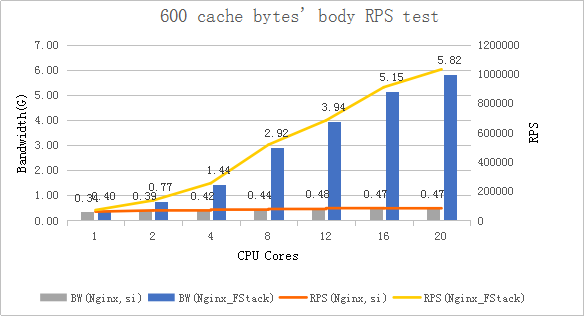
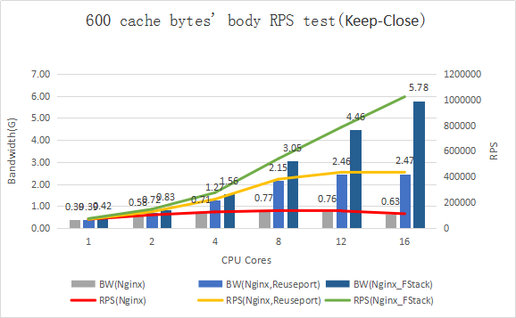
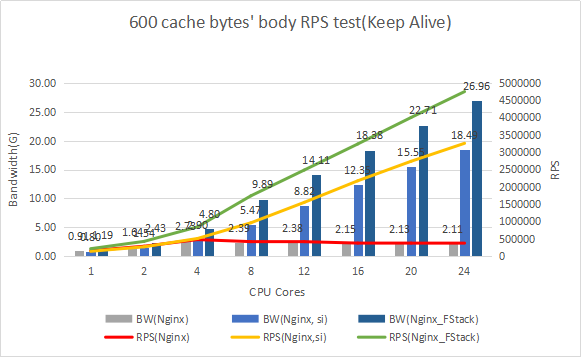
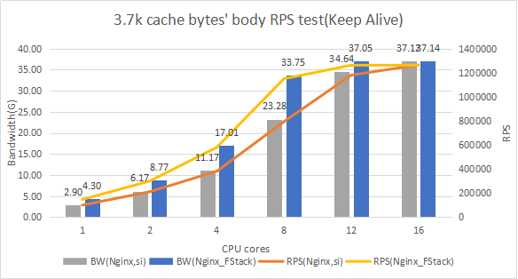

# F-Stack

## Introduction

With the rapid development of Network Interface Cards the poor performance of data packet processing with the Linux kernel has become the bottleneck in modern network systems. Yet, the increasing demands of the Internet's growth demand a higher performant network processing solution. Kernel bypass has emerged to catch more and more attention. There are various similar technologies such as: DPDK, NETMAP and PF_RING. The main idea of kernel bypass is that Linux is only used to deal with control flow; all data streams are processed in user space. Therefore, kernel bypass can avoid performance bottlenecks caused by kernel packet copying, thread scheduling, system calls, and interrupts. Furthermore, kernel bypass can achieve higher performance with multi-optimizing methods. Within various techniques, DPDK has been widely used because of it's more thorough isolation from kernel scheduling and active community support.

[F-Stack](http://www.f-stack.org/?from=github) is an open source high performant network framework based on DPDK with the following characteristics:

1. Ultra high network performance which the network card can achieve under full load: 10 million concurrent connections, 5 million RPS, 1 million CPS.
2. Transplant FreeBSD 11.01 user space stack, which provides a complete stack function, and cut a great amount of irrelevant features. This greatly enhances network performance.
3. Support Nginx, Redis, and other mature applications. Services can easily use F-Stack.
4. Easy to extend with multi-process architecture.
5. Provides micro thread interface. Various applications with stateful applications can easily use F-Stack to get high performance without processing complex asynchronous logic.
6. Provide an Epoll/Kqueue interface that allow many kinds of applications to easily use F-Stack.

## History

To deal with the increasingly severe DDoS attacks the authorized DNS server of Tencent Cloud DNSPod switched from Gigabit Ethernet to 10-Gigabit at the end of 2012. We faced several options: one is to continue to use the original network stack in the Linux kernel, another is to use kernel bypass techniques. After several rounds of investigation; we finally chose to develop our next generation of DNS server based on DPDK. The reason is DPDK provides ultra-high performance and can be seamlessly extended to 40G, or even 100G NIC, in the future.

After several months of development and testing, DKDNS, high-performance DNS server based on DPDK officially released in October 2013. It's capable of achieving up to 11 million QPS with a single 10GE port and 18.2 million QPS with two 10GE ports. And then we developed a user-space TCP/IP stack called F-Stack that can process 0.6 million RPS with a single 10GE port.

With the fast growth of Tencent Cloud more and more of our services needed higher network access performance. Meanwhile, F-Stack was continuing to improve, being driven by our business growth, and, ultimately developed into a general network access framework. But our initial TCP/IP stack couldn't meet the needs of these services. Continuing to develop and maintain a complete high performance network stack would have been too expensive. After evaluating several plans; we finally determined to port FreeBSD's (11.0 stable) TCP/IP stack into F-Stack. Not only does this allow us to stop reinventing the wheel, we can take advantage of the the improvements the FreeBSD community will bring in the future. Thanks to [libplebnet](https://gitorious.org/freebsd/kmm-sandbox/commit/fa8a11970bc0ed092692736f175925766bebf6af?p=freebsd:kmm-sandbox.git;a=tree;f=lib/libplebnet;h=ae446dba0b4f8593b69b339ea667e12d5b709cfb;hb=refs/heads/work/svn_trunk_libplebnet) and [libuinet](https://github.com/pkelsey/libuinet) this work became a lot easier.

With the rapid development of all kinds of applications, in order to help different APPs quick and easily use F-Stack, F-Stack has integrated Nginx, Redis and other commonly used APPs, and a micro thread framework, and provides a standard Epoll/Kqueue interface.

Currently, besides authorized DNS server of DNSPod, there are various products in Tencent Cloud has used the F-Stack, such as HttpDNS (D+), COS access module, CDN access module, etc..

## Quick Start

    # clone F-Stack
    mkdir -p /data/f-stack
    git clone https://github.com/F-Stack/f-stack.git /data/f-stack

    # Install libnuma-dev
    yum install numactl-devel          # on Centos
    #sudo apt-get install libnuma-dev  # on Ubuntu

    pip3 install pyelftools --upgrade
    # Install python and modules for running DPDK python scripts
    pip3 install pyelftools --upgrade # RedHat/Centos
    sudo apt install python # On ubuntu
    #sudo pkg install python # On FreeBSD

    # Install dependencies (FreeBSD only)
    #pkg install meson pkgconf py38-pyelftools

    cd f-stack
    # Compile DPDK
    cd dpdk/
    meson -Denable_kmods=true build
    ninja -C build
    ninja -C build install

    # Set hugepage (Linux only)
    # single-node system
    echo 1024 > /sys/kernel/mm/hugepages/hugepages-2048kB/nr_hugepages

    # or NUMA (Linux only)
    echo 1024 > /sys/devices/system/node/node0/hugepages/hugepages-2048kB/nr_hugepages
    echo 1024 > /sys/devices/system/node/node1/hugepages/hugepages-2048kB/nr_hugepages

    # Using Hugepage with the DPDK (Linux only)
    mkdir /mnt/huge
    mount -t hugetlbfs nodev /mnt/huge

    # Close ASLR; it is necessary in multiple process (Linux only)
    echo 0 > /proc/sys/kernel/randomize_va_space

    # Offload NIC
    # For Linux:
    modprobe uio
    insmod /data/f-stack/dpdk/build/kernel/linux/igb_uio/igb_uio.ko
    insmod /data/f-stack/dpdk/build/kernel/linux/kni/rte_kni.ko carrier=on # carrier=on is necessary, otherwise need to be up `veth0` via `echo 1 > /sys/class/net/veth0/carrier`
    python dpdk-devbind.py --status
    ifconfig eth0 down
    python dpdk-devbind.py --bind=igb_uio eth0 # assuming that use 10GE NIC and eth0

    # For FreeBSD:
    # Refer DPDK FreeBSD guide to set tunables in /boot/loader.conf
    # Below is an example used for our testing machine
    #echo "hw.nic_uio.bdfs=\"2:0:0\"" >> /boot/loader.conf
    #echo "hw.contigmem.num_buffers=1" >> /boot/loader.conf
    #echo "hw.contigmem.buffer_size=1073741824" >> /boot/loader.conf
    #kldload contigmem
    #kldload nic_uio

    # On Ubuntu, use gawk instead of the default mawk.
    #sudo apt-get install gawk  # or execute `sudo update-alternatives --config awk` to choose gawk.

    # Install dependencies for F-Stack
    sudo apt install gcc make libssl-dev                            # On ubuntu
    #sudo pkg install gcc gmake openssl pkgconf libepoll-shim       # On FreeBSD

    # Upgrade pkg-config while version < 0.28
    #cd /data
    #wget https://pkg-config.freedesktop.org/releases/pkg-config-0.29.2.tar.gz
    #tar xzvf pkg-config-0.29.2.tar.gz
    #cd pkg-config-0.29.2
    #./configure --with-internal-glib
    #make
    #make install
    #mv /usr/bin/pkg-config /usr/bin/pkg-config.bak
    #ln -s /usr/local/bin/pkg-config /usr/bin/pkg-config
 
    # Compile F-Stack
    export FF_PATH=/data/f-stack
    export PKG_CONFIG_PATH=/usr/lib64/pkgconfig:/usr/local/lib64/pkgconfig:/usr/lib/pkgconfig
    cd /data/f-stack/lib/
    make    # On Linux
    #gmake   # On FreeBSD

    # Install F-STACK
    # libfstack.a will be installed to /usr/local/lib
    # ff_*.h will be installed to /usr/local/include
    # start.sh will be installed to /usr/local/bin/ff_start
    # config.ini will be installed to /etc/f-stack.conf
    make install    # On Linux
    #gmake install   # On FreeBSD

#### Nginx

    cd app/nginx-1.16.1
    bash ./configure --prefix=/usr/local/nginx_fstack --with-ff_module
    make
    make install
    cd ../..
    /usr/local/nginx_fstack/sbin/nginx

for more details, see [nginx guide](https://github.com/F-Stack/f-stack/blob/master/doc/F-Stack_Nginx_APP_Guide.md).

#### Redis

    cd app/redis-6.2.6/deps/jemalloc
    ./autogen.sh 
    cd app/redis-6.2.6/
    make
    make install

  If KNI is enabled in the configuration file, you should create a virtual NIC after F-Stack started, and set the ipaddr, netmask, mac addr, route table, etc. These addrs must be same with F-Stack.

  If you don't have another management port, you should execute a script like this.

    /usr/local/nginx_fstack/sbin/nginx
    sleep 10
    ifconfig veth0 <ipaddr>  netmask <netmask>  broadcast <broadcast> hw ether <mac addr>
    route add -net 0.0.0.0 gw <gateway> dev veth0
    echo 1 > /sys/class/net/veth0/carrier # if `carrier=on` not set while `insmod rte_kni.ko` 
    # route add -net ...  # other route rules

## Nginx Testing Result

Test environment

    NIC:Intel Corporation Ethernet Controller XL710 for 40GbE QSFP+
    CPU:Intel(R) Xeon(R) CPU E5-2670 v3 @ 2.30GHz(NUMA)
    Memory：128G
    OS:CentOS Linux release 7.2 (Final)
    Kernel：3.10.104-1-tlinux2-0041.tl2

Nginx uses linux kernel's default config, all soft interrupts are working in the first CPU core.

Nginx si means modify the smp_affinity of every IRQ, so that the decision to service an interrupt with a particular CPU is made at the hardware level, with no intervention from the kernel.

Nginx Reuseport means enable "reuseport" in `nginx.conf`.

Nginx_FStack's 600 cache bytes' body was returned directly in nginx.conf.

All of these test cases use CPUs' physical cores.

CPS (Connection:close, Small data packet)  test result

CPS_Reuseport (Connection:close, Small data packet)  test result, This test case runs in a different test environment

RPS (Connection:Keep-Alive, Small data packet) test data

Bandwidth (Connection:Keep-Alive, 3.7k bytes data packet) test data

## Licenses
See [LICENSE](LICENSE)

## Join us

Tencent Cloud F-Stack team developed F-Stack which is a general network framework based on DPDK and provides ultra high network performance. We are here looking for more and more talented people with great passion on technology to join us. You would have the chance to work with brightest minds on this planet and help Tencent cloud and F-stack continuously evolve. Send us your resume or refer your friend to us if you are interested in joining us.

Open Positions: Software engineer(C/C++), Web developer, IOS/Android developer, Product Manager, Operating Manager, etc.
Contact: Please send your resume to [us](mailto:allanhuang@tencent.com)
