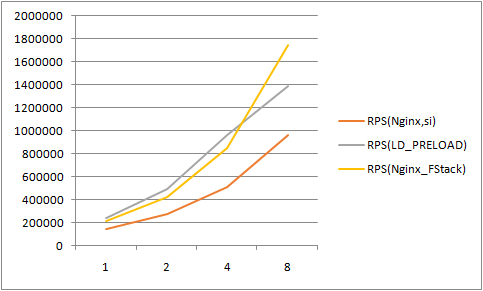
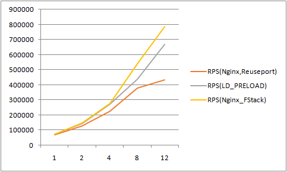

# F-Stack LD_PRELOAD Beta Introduction

This document mainly [Translated](https://lovelyping.com/?p=267) by ChatGPT.


The long-awaited `LD_PRELOAD` function module (later replaced by `libff_syscall.so`) has been submitted to the [adapter/sysctall](https://github.com/F-Stack/f-stack/tree/dev/adapter/syscall) directory in the F-Stack dev branch, which supports code hooking for system kernel socket-related interfaces, reducing the threshold for existing applications to port to F-Stack. The following will provide specific introductions, including the architecture related to `libff_syscall.so`, some of the considerations involved, the supported modes, and how to use it.

Overall conclusion:

- The barriers to entry for existing applications has been lowered compared to the standard F-Stack. In most cases, it is not necessary to modify the original user application and F-Stack lib code, but only modify the relevant code of `libff_syscall.so` to adapt.
- It can support multiple F-Stack instances (i.e., standard F-Stack application processes), and each F-Stack instance can correspond to one or more user applications.
  - To achieve optimal performance, it is recommended that one user application (process or thread) correspond to one F-Stack instance application, i.e., a group of application instances.
- The performance of each group of application instances will be slightly higher than that of the system kernel, and about the same compared to a single  standard F-Stack application process; the overall performance of a single machine is still much better than that of the system kernel, but there is still a gap compared to the  standard F-Stack.
  - The new group of application instances needs to run on two CPU cores, while the  standard F-Stack application process only needs to run on one CPU core. Overall, the cost-effectiveness is not high, and whether to use it depends on the specific situation of each business.
  - In the Nginx 600-byte body memory response test, the same number of new application instance groups in long connections is slightly higher than the  standard F-Stack application process, while the same number of new application instance groups in short connections is slightly lower than the  standard F-Stack application process, as shown in the Nginx access introduction section, but the CPU usage almost doubles.

【Note:】 Currently, the `libff_syscall.so` function is not yet complete and is only for testing purposes. All developers are welcome to work together to improve it. There are some issues as follows:

- There are still memory leaks and easy deadlocks when the process ends.
- Some interfaces (such as `sendmsg`, `readv`, `readmsg`, etc.) have not been optimized and tested because they have not been used yet, and further performance optimization and testing are needed.
- Lack of longer running verification, there may be some unknown hidden problems that have not been discovered yet.

## Compilation of `libff_syscall.so`

First, set the `FF_PATH` and `PKG_CONFIG_PATH` environment variables:

```
export FF_PATH=/data/f-stack
export PKG_CONFIG_PATH=/usr/lib64/pkgconfig:/usr/local/lib64/pkgconfig:/usr/lib/pkgconfig
```

Compile directly in the `adapter/sysctall` directory to obtain the relevant functional components of `libff_syscall.so`:

```
cd /data/f-stack/adapter/sysctall
make clean;make all

ls -lrt
fstack
libff_syscall.so
helloworld_stack
helloworld_stack_thread_socket
helloworld_stack_epoll
helloworld_stack_epoll_thread_socket
helloworld_stack_epoll_kernel
```

The main functions of each component will be introduced separately below.

### F-Stack Instance Application Program

The `fstack` application program corresponds to the application program in the standard version of F-Stack. Its operation is exactly the same as that of a normal F-Stack application program, including the configuration file and the multi-process (each process is an instance) running mode. The specific running method can refer to the [README](../../README.md) in the main directory of F-Stack. The `fstack` instance application program must be run before executing the user application program with `LD_PRELOAD`.

The main function of the `fstack` application program is to dock with the F-Stack API at the bottom layer. Its main function `ff_handle_each_context` is the user-level loop function of a normal F-Stack application. When it is not idle or every 10ms (affected by the `HZ` parameter), it will be called to loop through the context docked with the APP. If the APP has a corresponding API request, the actual F-Stack API will be called to process it.

IPC between `libff_syscall.so` user application processes uses Hugepage shared memory allocated by DPDK's `rte_malloc`.

This function has a **crucial** impact on the overall performance of `libff_syscall.so`. Currently, it reuses the `pkt_tx_dalay` parameter in the F-Stack main configuration file (`config.ini`), enters a dead loop, and delays for the specified value of this parameter before returning to other processing flows in F-Stack.

If you want to improve the overall performance of `libff_syscall.so`, the matching between the `fstack` instance application program and the APP application program is very important. Only when all events in one `ff_handle_each_context` loop are matched as much as possible, can the optimal performance be achieved. This requires very fine tuning, but currently, the rough value of the `pkt_tx_dalay` parameter is used.

【Tip】The default value of the `pkt_tx_dalay` parameter is 100us, which is more suitable for long connections. If it is a short connection scenario of Nginx, it should be set to 50us, which can achieve better performance. Of course, different usage scenarios may require business-specific adjustments and testing to achieve optimal performance. Reusing this parameter is only a temporary solution, and if there is a better solution in the future, it may be adjusted at any time.

### libff_syscall.so

The main function of this dynamic library is to hijack the system's socket-related interfaces and determine whether to call F-Stack's related interfaces (interacting with the fsack instance application program through the context sc) or the system kernel's related interfaces based on the fd parameter.

IPC between `libff_syscall.so` and the `fstack` instance application process uses Hugepage shared memory allocated by DPDK's `rte_malloc`.

【Note】Allocate the relevant memory when calling the related interface for the first time, and do not free it anymore. There is a memory leak problem when the process exits, which needs to be fixed.

F-Stack user application programs (such as helloworld or Nginx) use `LD_PRELOAD` to hijack the system's socket-related APIs when setting up, and can directly access the F-Stack development framework. You can refer to the following command:

```
export LD_PRELOAD=/data/f-stack/adapter/syscall/libff_syscall.so
```

Make sure that the `fstack` instance application program has been run correctly, and then start the user application program.

Of course, if the user's APP is modified to use `kqueue` instead of Linux's epoll-related event interface, you can also link the `libff_syscall.so` directly in the user APP. You can refer to the source files `main_stack.c` and `main_stack_thread_socket.c` corresponding to the sample programs `helloworld_stack` and `helloworld_stack_thread_socket`. Because it does not use `LD_PRELOAD`, this document will not go into details.

【Important reminder】A corresponding set of `fstack` application programs and user application programs should preferably run on **different physical cores** of the **same CPU NUMA node**, and other scenarios (running on the same CPU core, two CPU cores across NUMA nodes, mixing physical cores and hyper-threading cores) cannot achieve the best performance of a set of instances.

- In particular, if the CPU physical cores are relatively scarce, you can consider running a set of instances on the corresponding physical cores and HT cores of a group of CPUs, although the performance of a single set of instances will decrease by about 20%, but more CPU cores can be used, and the overall performance of a single machine may be improved.

### DEMO Demo Program helloworld_stack*

Other executable files starting with `hello_world` are related demo programs for different running modes supported by the current `libff_syscall.so`, which will be discussed in detail in the next section.

## Several Modes Supported by F-Stack LD_PRELOAD

In order to adapt to the different ways in which different applications use socket interfaces, reduce the threshold for existing applications to port to F-Stack, and maximize performance, the current `libff_syscall.so` of F-Stack mainly supports the following modes: multi-threaded PIPELINE mode, RTC (run to completion) mode within threads (processes), FF_KERNEL_EVENT mode that supports both F-Stack and kernel socket interfaces, and FF_MULTI_SC mode similar to kernel SO_REUSEPORT.

### Multi-threaded PIPELINE Mode

This mode is the default mode, and `libff_syscall.so` can be compiled directly without any additional settings.

In this mode, the fd returned by the socket-related interface **can be called in different threads interchangeably**, that is, it supports the PIPELINE mode, which is more friendly for porting and integrating existing applications, but correspondingly, there will be more performance losses.

In addition to single-process running mode, this mode can also **support user application programs to run in multi-process mode**, with each user process corresponding to an instance of the `fstack` instance application program. For more information, please refer to the running parameter introduction in the appendix.

【Note】Applications that access F-Stack in this default way can only use F-Stack's socket network interface, not the system's socket interface.

#### Hook System epoll Interface

For existing applications under Linux, the event interface generally uses the `epoll` related interface. For applications that do not have more special requirements, you can directly use the default compilation parameters to compile `libff_syscall.so` and then use it. Refer to the DEMO program `helloworld_stack_epoll`, and the code file is `main_stack_epoll.c`.

【Note】F-Stack's `epoll` interface is still a encapsulation of the `kqueue` interface. It still has some differences from the system's standard `epoll` event interface in terms of usage, mainly in the way events are triggered and the difference in multi-accept.

#### Using kqueue

Of course, in addition to supporting the use of `LD_PRELOAD` to hook the system's socket interface, `libff_syscall.so` also supports normal linking usage. At this time, in addition to using the system's `epoll` event interface, it can also use the `kqueue` event interface that F-Stack (FreeBSD) has. Refer to the DEMO program `helloworld_stack`, and the code file is `main_stack.c`.

The performance of this usage method is slightly better than using the system's `epoll` interface with `LD_PRELOAD`.

### RTC (run to completion) mode within threads (processes)

This mode needs to set additional compilation parameters to enable it, and `libff_syscall.so` can be compiled after enabling `FF_THREAD_SOCKET` in `adapter/sysctall/Makefile` or executing the following shell command.

```
export FF_THREAD_SOCKET=1
make clean;make all
```

In this mode, the fd returned by the socket-related interface **can only be called within the current thread**, that is, it only supports the RTC mode within threads, which has a slightly higher threshold for porting and integrating existing applications, but correspondingly, there will be some performance improvements, which is suitable for applications that originally run in RTC mode.

Similarly, in addition to single-process running mode, this mode can also **support user application programs to run in multi-process mode**, with each user process corresponding to an instance of the `fstack` instance application program. For more information, please refer to the running parameter introduction in the appendix.

【Note】Applications that access F-Stack in this default way can only use F-Stack's socket network interface, not the system's socket interface.

#### Hook System epoll Interface

Other same as the default PIPELINE mode, you can refer to the DEMO program `helloworld_stack_epoll_thread_socket`, and the code file is `main_stack_epoll_thread_socket.c`.

#### Using kqueue

Other same as the default PIPELINE mode, you can refer to the DEMO program `helloworld_stack_thread_socket`, and the code file is `main_stack_thread_socket.c`.

### FF_KERNEL_EVENT Mode

This mode can support both F-Stack and the system kernel's socket interface at the same time. It needs to set additional compilation parameters to enable it, and `FF_KERNEL_EVENT` can be enabled in `adapter/sysctall/Makefile` or executing the following shell command.

```
export FF_KERNEL_EVENT=1
make clean;make all
```

In this mode, the `epoll` related interface will call the system kernel's related interface while calling the F-Stack interface, and establish a mapping relationship between the fd returned by F-Stack and the fd returned by the system kernel. This is mainly to support two scenarios:

- There are control fds and data fds using the same epoll fd in the user application program, such as Nginx.
- Want to access the network interface that the user application program listens to on the local machine at the same time.
  - If you want to communicate with the local system kernel separately, you need to call the `socket` interface separately and specify the `type | SOCK_KERNEL` parameter. You also need to call `bind()`, `listen()`, `epoll_ctl()` and other interfaces separately for the returned fd. Refer to the DEMO program `helloworld_stack_epoll_kernel`, and the code file is `main_stack_epoll_kernel.c`.

【Note 1】The FreeBSD kernel parameter `kern.maxfiles` in F-Stack should not be greater than 65536 (the original default value is 33554432) to ensure the correct mapping of F-Stack's epoll fd to the system kernel's epoll fd.

【Note 2】Seamless integration of Nginx requires enabling this mode because there are multiple control fds and data fds using the same epoll fd in Nginx.

### FF_MULTI_SC Mode

This mode is set for special settings such as Nginx using the kernel's `SO_REUSEPORT` and running worker processes with `fork`. It needs to set additional compilation parameters to enable it, and `FF_MULTI_SC` can be enabled in `adapter/sysctall/Makefile` or executing the following shell command.

```
export FF_MULTI_SC=1
make clean;make all
```

In this mode, the context `sc` associated with the user application program and the `fstack` instance is not only saved in the global variable `sc`, but also saved in the global `scs` array. When forking the worker process, the `sc` variable is set to the corresponding sc of the worker process fd using `current_worker_id` for the child process to copy and use.

The main process of Nginx's `reuseport` mode is that the main process calls `socket()`, `bind()`, `listen()` and other interfaces for each worker process respectively, and copies them to the worker process. Then, each worker process calls the `epoll` related interface to process its own fd, and the corresponding context sc of each fd is needed to run correctly.

【Note】Seamless integration of Nginx requires enabling both `FF_THREAD_SOCKET` and `FF_MULTI_SC` modes at the same time.

## Introduction to integrating `libff_syscall.so` with Nginx

Nginx (using Nginx-1.16.1 included in F-Stack by default as an example) can currently integrate with F-Stack directly without modifying any code by using the `LD_PRELOAD` dynamic library `libff_syscall.so`. The following are the main steps and effects.

### Compile `libff_syscall.so`

Both `FF_THREAD_SOCKET` and `FF_MULTI_SC` modes need to be enabled for compilation.

```
export FF_PATH=/data/f-stack
export PKG_CONFIG_PATH=/usr/lib64/pkgconfig:/usr/local/lib64/pkgconfig:/usr/lib/pkgconfig

cd /data/f-stack/adapter/sysctall
export FF_KERNEL_EVENT=1
export FF_MULTI_SC=1
make clean;make all
```

### Configure `nginx.conf`

The following are examples of the main configuration parameters that need to be noted and modified (not a complete list):

```
user  root;
worker_processes  4; # Number of worker processes
worker_cpu_affinity 10000 100000 1000000 10000000; # Set CPU affinity

events {
    worker_connections  1024;
    multi_accept on; # epoll is a wrapper for kqueue interface and must be turned on
    use epoll;
}

http {
    access_log  off; # Turn off access logs to improve network performance during testing. Otherwise, each request requires an additional call to the system's write() interface to record the access log.

    sendfile        off; # Need to turn off when using F-Stack

    keepalive_timeout  0; # Adjust according to the business needs of long connections/short connections
    #keepalive_timeout  65;
    #keepalive_requests 200; # By default, each long connection can have up to 100 requests. Adjust according to business needs. Increasing this value appropriately for long connections can slightly improve performance.

    server {
        listen       80 reuseport; # Should set reuseport, which is not consistent with the reuseport behavior of using the system kernel, but both can improve performance

        access_log off;

        location / {
            #root   html;
            #index  index.html index.htm;
            return 200 "0123456789abcdefghijklmnopqrstuvwxyz"; # Directly return data to test pure network performance
        }
    }
}
```

【Note】The purpose of `reuseport` here is to use multiple different socket fds, and each fd can be docked with the context `sc` of a different `fstack` instance application program to distribute requests, thereby improving performance. It is similar to the behavior of the system kernel's `reuseport`.

### Running Nginx server

Assuming running 4 sets of Nginx-fstack instance application programs, you can simply follow these steps:

- Run the fstack instance

  - Set `lcore_mask=f00` in `config.ini`, that is, use CPU cores 9-11, and configure other settings according to the standard F-Stack configuration.
  - Refer to the following command to start the fstack instance and wait for a while until both the fstack main process and the child process are started.

  ```
  cd /data/f-stack
  bash ./start.sh -b adapter/syscall/fstack
  ```

- Run Nginx

  - Refer to the following command to configure the environment variables required by `libff_syscall.so`

  ```
  export LD_PRELOAD=/data/f-stack/adapter/syscall/libff_syscall.so # Set LD_PRELOAD libff_syscall.so
  export FF_NB_FSTACK_INSTANCE=4 # Set 4 fstack instance application programs, and 4 workers are also configured in nginx.conf
  ```

  - Start Nginx

  ```
  /usr/local/nginx/sbin/nginx # Start Nginx
  ```

### Performance comparison

#### Test Environment

CPU: Intel(R) Xeon(R) CPU E5-2670 v3 @ 2.30GHz * 2

NIC: Intel Corporation Ethernet Controller 10-Gigabit X540-AT2

OS: TencentOS Server 3.2 (Final)

Kernel: 5.4.119-1-tlinux4-0009.1 #1 SMP Sun Jan 23 22:20:03 CST 2022 x86_64 x86_64 x86_64 GNU/Linux

#### Nginx Long Connection



- The body size is 602 bytes (excluding HTTP headers, etc.).
- The CPU actually used by LD_PRELOAD is almost twice the number of CPU cores on the horizontal axis, and the CPU actually used by the system kernel's balanced soft interrupt is also much higher than the number of CPU cores corresponding to the number of workers.
- Due to time constraints, the test data of LD_PRELOAD is the data of the above test environment, and the others are the data of the historical 40G test environment. The data will be updated to the same test environment later.
- Due to the limitation of the network card hardware, the bandwidth of the 8-core LD_PRELOAD test is **close to the 10G NIC line speed** (the server's outbound bandwidth is 9.xG, and the RPS is 1.48 million), which causes differences in data compared to standard F-Stack. There is still some CPU idle time in reality, and comparison tests should be conducted using 40G/100G NICs in the future.
- The `pkt_tx_delay` parameter is set to 100us.

#### Nginx Short Connection



- The body size is 602 bytes (excluding HTTP headers, etc.).
- The CPU actually used by LD_PRELOAD is almost twice the number of CPU cores on the horizontal axis, and the CPU actually used by the system kernel's balanced soft interrupt is also much higher than the number of CPU cores corresponding to the number of workers.
- Due to CPU hardware limitations (12C24HT * 2), the LD_PRELOAD test can only test 12 sets of application instance groups, that is, using all physical cores of the CPU, and cannot perform tests with more instance groups.
- After 8 cores, the performance of LD_PRELOAD is not as good as the performance of standard F-Stack. The main reason is that the matching degree between the user application program and the fstack application program (such as the number of loops and time of `ff_handle_each_context`) is not high, and the performance has not been fully optimized. If continuous fine-tuning is performed, performance can be further improved, but the generality is not high.
- The `pkt_tx_delay` parameter is adjusted from 100us to 50us.

## Appendix: Detailed Parameter Introduction

### Compilation Parameters

This section provides an overall introduction to various compilation options. All parameters can be enabled in `adapter/sysctall/Makefile` or set environment variables through shell commands to enable.

#### DEBUG

Enable or disable DEBUG mode, which mainly affects optimization and log output, and is disabled by default.

```
export DEBUG=-O0 -gdwarf-2 -g3
```

The default optimization parameters are

```
-g -O2 -DNDEBUG
```

#### FF_THREAD_SOCKET

Whether to enable thread-level context `sc` variables. If enabled, socket-related fds can only be called in the current thread, which can slightly improve performance. It is disabled by default.

```
export FF_THREAD_SOCKET=1
```

#### FF_KERNEL_EVENT

Whether to enable the `epoll` related interface to call the system kernel's related interface while calling the F-Stack interface, and establish a mapping relationship between the fds returned by F-Stack and the fds returned by the system kernel. It is disabled by default and mainly used to support two scenarios:

- The user application program has control over the fd and the data fd uses the same epoll fd, such as Nginx.
- Hope that the local machine can also access the network interface listened by the user application program at the same time.

```
export FF_KERNEL_EVENT=1
```

#### FF_MULTI_SC

In this mode, the context `sc` associated with the user application program and the `fstack` instance is saved not only in the global variable `sc`, but also in the global `scs` array. When forking the worker child process, `sc` variable is set to the corresponding worker process fd's sc using `current_worker_id`, which is used for copying and use by the child process. It is disabled by default.

```
export FF_KERNEL_EVENT=1
```

### Running Parameters

You can set some parameter values required by the user application program through environment variables. If you configure them through a configuration file later, you may need to modify the original application, so temporarily use the method of setting environment variables.

#### LD_PRELOAD

Set the LD_PRELOAD runtime library and then run the actual application program. You can refer to the following command:

```
export LD_PRELOAD=/data/f-stack/adapter/syscall/libff_syscall.so
```

If you want to debug the application program through `gdb`, you can refer to the following command:

```
export LD_PRELOAD=
gdb ./helloworld_stack_epoll
(gdb) set exec-wrapper env 'LD_PRELOAD=/data/f-stack/adapter/syscall/libff_syscall.so'
```

#### FF_NB_FSTACK_INSTANCE

Set the number of `fstack` instance application programs, which is used to match the number of worker processes/threads of the user application program. The default value is 1.

```
export FF_NB_FSTACK_INSTANCE=4
```

It is recommended to configure the number of worker processes/threads of the user application program and the `fstack` instance application program as 1:1 as possible to achieve better performance.

#### FF_INITIAL_LCORE_ID

Configure the starting CPU logical ID for CPU affinity binding of the user application program, in hexadecimal, with a default value of 0x4 (0b0100), which is CPU 2.

```
export FF_INITIAL_LCORE_ID=0x4
```

If the user application program can configure CPU affinity, you can ignore this parameter, such as the `worker_cpu_affinity` parameter in the Nginx configuration file.

#### FF_PROC_ID

Configure the process ID of the user application program, which can be used with the `FF_INITIAL_LCORE_ID` parameter to set the CPU affinity binding in decimal increments, with a default value of 0.

```
export FF_PROC_ID=1
```

If the user application program can configure CPU affinity, you can ignore this parameter, such as the `worker_cpu_affinity` parameter in the Nginx 
