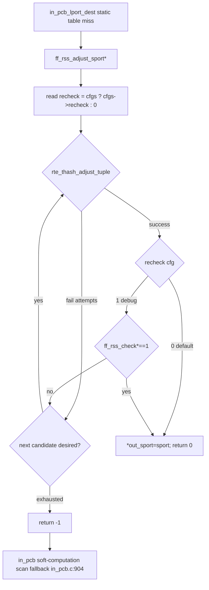

# 04 Architecture and Design — ff_rss_check Three Optimizations

> Principle: the design's landing points are based on actual code/headers, with `file:line` given at key points; unresolved items are marked "pending confirmation" along with a leaning proposal.
> Gating: all kernel-side changes are uniformly wrapped in `#ifdef FSTACK`; disabling FSTACK reverts to native FreeBSD behavior; new user-space capabilities cause **zero regression** on the IPv4 fast path.
> Dependent facts: 01 requirements, 02 current state (13.0↔15.0 diff, user-space RSS, IPv6 gap, rte_thash), 03 external research.

---

## 0. Overall Architecture and Data Flow

### 0.1 Overall Data Flow for RSS Port Selection (Active connect())

```
Application connect()
  └─ Kernel in_pcbconnect (in_pcb.c:1083)
       ├─ in_nullhost(inp_laddr)? → select local address laddr
       │     Native: in_pcbladdr (L1129)
       │     【0.1 back-port】FSTACK: first call ff_in_pcbladdr(AF_INET, faddr, fport, &laddr) to select a local address aligned with RSS
       └─ anonport (no local port)? → in_pcb_lport_dest(... lookupflags)  (L1145)
             Native: passes only INPLOOKUP_WILDCARD
             【0.1 back-port】FSTACK: passes INPLOOKUP_WILDCARD | INPLOOKUP_LPORT_RSS_CHECK
                 └─ in_pcb_lport_dest (in_pcb.c:756)
                      ├─ Parse and clear INPLOOKUP_LPORT_RSS_CHECK
                      ├─ Static table hit: ff_rss_tbl_get_portrange() → rotate through the port set that falls on the local queue (fast path)
                      └─ Static table miss: per-port + ff_rss_check() soft-computation to verify landing in the local queue
                            【0.3 optimization】the dynamic path switches to reverse-computing the port via rte_thash_adjust_tuple
```

Three-layer relationship (consistent with the existing three-layer architecture):
- **User-space lib** (`ff_dpdk_if.c`): RSS hash soft computation (`ff_rss_check`), static table (`ff_rss_tbl_*`), local-address callback bridge (`ff_in_pcbladdr`), 【0.3 new】thash ctx.
- **Kernel hooks** (`in_pcb.c` / `in6_pcb.c`): call user-space interfaces when selecting a port, gated by `#ifdef FSTACK`.
- **Configuration** (`ff_config.c` / config.ini): the `rss_check` section, 【0.2 new】v6 rule format, the `symmetric_rss` switch (already exists).

### 0.2 Dependencies Among the Three Items
- 0.1 is a prerequisite for 0.3 (0.3's dynamic path hangs off the "miss" branch of `in_pcb_lport_dest` after the 0.1 back-port).
- 0.2 (IPv6) is independent of the 0.1/0.3 IPv4 path, but its user-space hash/table-structure extension will be reused by 0.3 (the IPv6 dynamic path also goes through thash).
- Suggested implementation order: 0.1 → 0.3 (IPv4 dynamic optimization) → 0.2 (full IPv6 chain, reusing the 0.1/0.3 framework). Details in 06.

---

## 1. Design for Requirement 0.1: Back-Porting Kernel-Side RSS Port Selection to 15.0

### 1.1 List of Landing Points and Changes (Based on Actual 15.0 Code)

| Change point | file:line | 13.0 reference | Change content |
|--------|-----------|-----------|----------|
| (A) Port selection logic | `in_pcb.c` `in_pcb_lport_dest`(L756) body | 13.0 L689 body (L703-915) | Back-port the rss_* local variables, flag parsing/clearing, portrange acquisition, hit-rotation/miss-soft-computation |
| (B) Local address integration | `in_pcb.c` `in_pcbconnect`(L1128 branch) | 13.0 `in_pcbconnect_setup` L1526-1530 | Inside the `in_nullhost` branch, before `in_pcbladdr`, insert `ff_in_pcbladdr(AF_INET,...)` |
| (C) Flag passing | `in_pcb.c` `in_pcbconnect`(L1145-1147) | 13.0 L1583-1589 | Add `INPLOOKUP_LPORT_RSS_CHECK` to lookupflags |
| (D) Macro handling | `in_pcb.h:623-625` | Same as 13.0 | Keep `#define 0x80000000` (outside the enum), see §1.3 |

### 1.2 (A) `in_pcb_lport_dest` Back-Port Details (Adapted for 15.0)

The complete 13.0 logic (evidenced in 02 §2.1) is back-ported, but must be adapted for 15.0:

1. **Local variable declarations** (corresponding to 13.0 L703-709): `u_short rss_first, rss_last, *rss_portrange;`, `static int rss_tbl_init=0;`, `int rss_check_flag`, `int rss_ret, rss_match=0;`, `struct ifaddr *ifa; struct ifnet *ifp;`, all under `#ifdef FSTACK`.
2. **Flag parsing + clearing** (corresponding to 13.0 L707/L712):
   `rss_check_flag = lookupflags & INPLOOKUP_LPORT_RSS_CHECK;`
   `lookupflags &= ~INPLOOKUP_LPORT_RSS_CHECK;`
   Note: in 15.0 `inp` is `const struct inpcb *` (L756) — `lookupflags` is a value parameter (int) and may be modified directly; the content pointed to by `inp` must not be modified.
3. **Acquiring the portrange** (corresponding to 13.0 L794-830): on first call, `ff_rss_tbl_set_portrange(first,last)`; on hit, `ff_rss_tbl_get_portrange(faddr.s_addr, laddr.s_addr, fport, &rss_first, &rss_last, &rss_portrange)` sets `rss_match=1`; on miss, use `ifa_ifwithnet` to find `ifp` (for the soft computation to use `ifp->if_softc`).
   - **15.0 adaptation**: 13.0 uses the local variable `dorandom` (L814/L834); 15.0's function inlines `V_ipport_randomized` (L830). During back-porting, change 13.0's `dorandom` to `V_ipport_randomized`, while preserving the semantics that "when rss_match, randomization applies to the index into `rss_portrange[0]`" (13.0 L814-815).
4. **Main port-selection loop** (corresponding to 13.0 L842-915):
   - Hit (`rss_check_flag && rss_match`): rotate `*lastport` through `rss_portrange[]` (13.0 L846-851); the port set already guarantees landing in the local queue, **skipping the RSS re-computation in the lookup**.
   - Miss (`!rss_check_flag || !rss_match`): native `++*lastport` (13.0 L853-860 = 15.0 L838-840).
   - Dynamic verification on miss (13.0 L896-911): after `in_pcblookup_local` finds a free slot, for LOOPBACK break immediately (13.0 L902-903); otherwise soft-compute `ff_rss_check(ifp->if_softc, faddr.s_addr, laddr.s_addr, fport, lport)`; break if it lands in the local queue, otherwise `tmpinp++` and continue (13.0 L909). **0.3 will replace the soft-computation scan here with thash reverse-computation (see §3)**.
   - **15.0 adaptation (lookup signature)**: 13.0 `in_pcblookup_local(pcbinfo, laddr, lport, lookupflags, cred)` (L894) → in 15.0 changes to `in_pcblookup_local(pcbinfo, laddr, lport, RT_ALL_FIBS, lookupflags, cred)` (02 §2.0, 15.0 L877-878); the final parameters of `in_pcblookup_hash_locked`, 13.0 `NULL, M_NODOM` (L873) → 15.0 `M_NODOM, RT_ALL_FIBS` (L848). The back-ported code must align with 15.0's existing call form (directly reuse the existing lookup calls at L843-880, only wrapping the RSS branch around the outside).

### 1.3 (D) Whether `INPLOOKUP_LPORT_RSS_CHECK` Should Be Included in `INPLOOKUP_MASK`
- Current state (02 §2.2): `INPLOOKUP_LPORT_RSS_CHECK = 0x80000000` is outside the enum (`in_pcb.h:623-625`), not in `INPLOOKUP_MASK` (L627).
- **Design decision (leaning): keep it outside the enum and not included in MASK, following 13.0's behavior** — at the entry of `in_pcb_lport_dest`, extract the flag first, then clear it from `lookupflags` (§1.2.2), so it does not pollute downstream `in_pcblookup_*` calls (which compare against MASK). Reason: including it in MASK could instead cause downstream lookups to misinterpret this bit; 13.0 has already verified the "parse then immediately clear" approach as correct.
- Alternative: include it in the enum and expand MASK — this would require auditing all usage points of `lookupflags & INPLOOKUP_MASK`, with a larger and riskier change footprint, **not recommended**.

### 1.4 Risks and Regressions
- With FSTACK disabled: all `#ifdef FSTACK` sections are not compiled, reverting to native behavior (no regression).
- With `rss_check` enable=0 / single queue: `ff_rss_check` returns 1 directly when `nb_queues<=1` (`ff_dpdk_if.c:2858`); `ff_rss_tbl_get_portrange` returns -1 (config not enabled); `rss_match=0`; automatically falls back to the native path.
- LOOPBACK (`127.0.0.1`): 13.0 already special-cases a break (no RSS applied); this is preserved in the back-port, ensuring the kernel stack's local loopback works normally.

---

## 2. Design for Requirement 0.2: IPv6 RSS Hash and Port Selection

### 2.1 User-Space Hash Input Layout (IPv6)
- IPv4 current state: `saddr(4)+daddr(4)+sport(2)+dport(2)=12B` (`ff_dpdk_if.c:2865-2880`).
- IPv6 target layout: `saddr6(16)+daddr6(16)+sport(2)+dport(2)=36B` (satisfies 0.3's `tuple_len` being a multiple of 4: 36/4=9).
- Queue-landing determination formula unchanged: `((hash & (reta_size-1)) % nb_queues) == queueid`.

### 2.2 Interface and Table Structure IPv6-ification — Comparison of Two Approaches

**Approach A: add v6-specific functions + v6-specific table (recommended)**
- Add `ff_rss_check6(softc, struct in6_addr *saddr6, *daddr6, sport, dport)`, `ff_rss_tbl6_*`, `struct ff_rss_tbl6_type` (16B address).
- Pros: the IPv4 structure `struct ff_rss_tbl_type` (`ff_dpdk_if.c:165`)/`ff_rss_check` (L2851) is **completely untouched → zero regression on the IPv4 fast path** (satisfies 01 §2.4 / acceptance criteria); v4/v6 each has its own cache-line alignment with no padding waste.
- Cons: some code duplication (hash assembly, table lookup logic each in two copies), which can be consolidated with static helpers for common parts.

**Approach B: use a 16B union for addresses, sharing one set of structures/functions across v4/v6**
- `struct ff_rss_tbl_type`'s `saddr/daddr` change from `uint32_t` to a 16B union (`union { uint32_t v4; uint8_t v6[16]; }`), and `ff_rss_check` gains a `family` parameter.
- Pros: a single code path, no duplication.
- Cons:
  1. **Changing the `ff_rss_check` signature → breaks the existing calls after the 0.1 kernel back-port** (the 13.0 call form `ff_rss_check(softc, faddr.s_addr, laddr.s_addr, fport, lport)` would need to change), increasing coupling and the regression surface.
  2. Static table entries grow in memory (addresses 4B→16B; the table `dip_tbl[MAX_DADDR]` × `[MAX_SADDR_SPORT_ENTRIES]`), wasting memory in the IPv4-only case, and the `__rte_cache_aligned` layout change may affect IPv4 cache locality → **the IPv4 fast path could regress**.

- **Design decision: adopt Approach A (v6-independent function/table)**. The core reason is the hard acceptance constraint of 01: "zero regression on the IPv4 path + no changes to existing IPv4 interface signatures". Approach B's signature change and memory growth directly conflict with this constraint. 【Pending confirmation: the value of the v6 table capacity macros (`FF_RSS_TBL6_MAX_*`), leaning toward reusing the same values as the v4 macros (`ff_config.h:62-76`) to reuse the capacity assumptions, to be re-examined against the memory budget during the coding phase.】

### 2.3 Kernel-Side IPv6 Port-Selection Integration Point
- Fact (02 §3.2): neither 13.0 nor 15.0's `in6_pcb.c` has RSS integration (all brand new).
- Key finding: 15.0's `in_pcb_lport_dest` (L756) **is itself already a unified v4/v6 function** — containing INET6 branches: `laddr6/faddr6` (L819-825), `in6_pcblookup_hash_locked` (L853), `in6_pcblookup_local` (L861).
- **Design decision (leaning): prioritize reusing the unified path `in_pcb_lport_dest`** — the RSS port-selection logic back-ported by 0.1 also adds an RSS hook to the INET6 branch within this function (using `laddr6/faddr6` to call `ff_rss_check6` / `ff_rss_tbl6_get_portrange`), avoiding a separate implementation in `in6_pcb.c`.
- But it must be confirmed whether IPv6 connect actually selects a port via this function:
  - The entry point is the `in6_pcbconnect` family (`in6_pcb.c`); when selecting anonport, does it call `in_pcb_lport_dest` (as IPv4's `in_pcbconnect` does at L1145) or is there a separate `in6_pcb_lport`?
  - 【Pending confirmation: the IPv6 connect port-selection call chain and the propagation point of `INPLOOKUP_LPORT_RSS_CHECK`, to be verified via grepping `in6_pcbconnect`/`in6_pcb_lport` during the coding phase. Leaning proposal: if `in6_pcbconnect` reuses `in_pcb_lport_dest`, then it only needs to pass the RSS flag at the port-selection call site in `in6_pcbconnect` + add `ff_in_pcbladdr(AF_INET6_FREEBSD,...)` at the same location in `in_pcbconnect` (`ff_in_pcbladdr` already supports v6, `ff_dpdk_if.c:2581-2584`); if there's an independent path, then create a corresponding hook in `in6_pcb.c` (reusing this function's logic).】

### 2.4 NIC / DPDK RSS Offload Field (IPv6)
- Current state (already confirmed): `default_rss_hf = RTE_ETH_RSS_PROTO_MASK` (`ff_dpdk_if.c:681-683`); `RTE_ETH_RSS_PROTO_MASK` **already includes all protocol fields, including IPv6/TCP_IPV6**, then it's `&= dev_info.flow_type_rss_offloads` (L705) to narrow based on hardware capability.
- **Conclusion: the default rss_hf already enables IPv6 RSS**, so 0.2 generally **does not need to change the rss_hf configuration**; it only needs to confirm the target NIC's `flow_type_rss_offloads` includes `RTE_ETH_RSS_IPV6`/`RTE_ETH_RSS_NONFRAG_IPV6_TCP` (otherwise it would be narrowed away at L705, and IPv6 RSS would fall to a single queue).
- Note: the rte_flow rule at `ff_dpdk_if.c:1001/1167` hardcodes `RTE_ETH_RSS_NONFRAG_IPV4_TCP` (for flow-distribution scenarios); if that path needs v6 support, v6 type must be added in sync. 【Pending confirmation: whether this project involves that rte_flow path; to be confirmed during the coding phase; leaning: this project's RSS port selection mainly goes through the port_conf.rss_hf path, and the rte_flow path is not within the 0.2 scope for now, just noted.】

### 2.5 Configuration v6 Parsing
- Current state (02 §5.1): `rss_tbl_cfg_handler` (`ff_config.c:880-921`) uses `inet_pton(AF_INET, ...)` to parse daddr/saddr (L913-914).
- 0.2 change: determine v6 by whether the text contains `:`, and parse using `inet_pton(AF_INET6, ...)` into 16B, stored in the v6 rule structure (see 05 config item changes). The IPv4 parsing branch remains unchanged (zero regression).

### 2.6 Risks
- IPv4 zero regression: Approach A does not touch the v4 structures/functions (analyzed above).
- Memory: the memory budget for the new v6 table needs to be assessed (§2.2 pending confirmation).
- Reusing the unified kernel path must be based on the actual call chain (§2.3 pending confirmation).

---

## 3. Design for Requirement 0.3: Optimizing the Dynamic Path with rte_thash_adjust_tuple

### 3.1 Overall Strategy: The Static Table Fast Path Is Unchanged; Only "the Dynamic Scan When the Static Table Is Missed" Is Optimized
- **Retained**: the `ff_rss_tbl` (`ff_dpdk_if.c:172`) static-table hit path (§1.2 hit branch) remains completely unchanged (best performance, explicitly retained by 01 §3.4).
- **Replacement target**: the O(number of ports) scan of "per-port `++*lastport` + `ff_rss_check` soft computation" in the miss branch of `in_pcb_lport_dest` (13.0 L896-911), changed to: use `rte_thash_adjust_tuple` to **reverse-compute** a source port that lands in the local queue, in one step (or a few attempts).
- **Fallback**: when thash reverse-computation fails (attempts exhausted / non-convergence under an asymmetric key), fall back to the existing soft `ff_rss_check` scan (guaranteeing a correctness floor).

### 3.2 thash ctx Lifecycle and Helpers
- Built once during initialization (near `ff_rss_tbl_init` or after port configuration):
  - `ctx = rte_thash_init_ctx(name, rsskey_len, reta_sz_log2, rsskey, flags)`.
    - `reta_sz` is passed as **the logarithm** (`rte_thash.h:288-291`): `reta_sz_log2 = log2(rss_reta_size[port])` (`rss_reta_size` see `ff_dpdk_if.c:133`; reta_size is always a power of 2, so log2 is exact).
    - `key` is passed as the current `rsskey` (`ff_dpdk_if.c:121`, consistent with the NIC).
  - `rte_thash_add_helper(ctx, "sport", helper_len, sport_offset_bits)`:
    - `offset` = the bit offset of the source-port field within the tuple (IPv4 tuple `saddr(4)+daddr(4)+sport(2)+dport(2)`, sport at byte 8 → offset=64 bit; IPv6 tuple sport at byte 32 → offset=256 bit).
    - `len` ≥ `reta_sz_log2` (`rte_thash.h:340-341`), and should cover the range of adjustable sport bits (sport is 16 bits). Leaning toward `len=16` (the entire sport field is adjustable).
  - **Not thread-safe** (`rte_thash.h:333`): the ctx/helper are only built during initialization; at runtime only read-only `adjust_tuple` calls are used (which are thread-safe, L433).
- One ctx per port (reta_size may differ), stored in a per-port array.

### 3.3 【Core】Deriving the queueid → desired_value Mapping (Queue-Landing Alignment)

This is the crux of 0.3's correctness (03 §3.4 risk point 1). It must be ensured that the port reverse-computed by `adjust_tuple`, after being rechecked by `ff_rss_check`, **actually** satisfies `((hash & (reta_size-1)) % nb_queues) == queueid`.

Definitions:
- `R = reta_size` (a power of 2), `reta_sz_log2 = log2(R)`.
- `Q = nb_queues`, `q = queueid` (the target local queue).
- `adjust_tuple`'s `desired_value` aligns to the **low `reta_sz_log2` bits** of the hash, i.e., making `hash & (R-1) == desired_value` (`rte_thash.h:443-444` + the helper's len covering reta_sz).
- The queue-landing determination requires: `(hash & (R-1)) % Q == q`, i.e. `desired_value % Q == q`.

**Derived conclusion**: the set of `desired_value` values satisfying the condition is
`D(q) = { v ∈ [0, R) | v % Q == q }`, i.e. `v = q, q+Q, q+2Q, ... < R`, about `R/Q` candidates in total.

**Algorithm (each time a port needs to be selected)**:
1. Pick any `desired_value ∈ D(q)` (e.g. rotating through them, spreading across reta entries to avoid hotspots).
2. Call `rte_thash_adjust_tuple(ctx, h, tuple, tuple_len, desired_value, attempts, fn, ud)` to reverse-compute the sport such that `hash & (R-1) == desired_value`.
3. By the derivation above, at that point `(hash & (R-1)) % Q == desired_value % Q == q` ⇒ **lands in the local queue**, holds.
4. The `fn` callback hooks a "port not in use" check (combined with `in_pcblookup_local`), so the reverse-computed port is simultaneously available.
5. **Independent recheck (mandatory)**: for the reverse-computed sport, call the soft `ff_rss_check(...)` (`ff_dpdk_if.c:2851`) once more to confirm it returns 1, as a correctness assertion (preventing key/offset configuration drift from selecting the wrong queue, corresponding to 01 §3.5 acceptance criteria). If the recheck fails, discard that port and fall back to the soft scan.

**Special cases**:
- If `R % Q == 0` (reta_size is an integer multiple of nb_queues, common case), `D(q)` is uniform and the mapping is clean.
- If `R % Q != 0`, `|D(q)|` differs across queues (the last queue has slightly fewer candidates), but is still non-empty (since `q < Q ≤ R`), so the algorithm still holds; the non-uniformity only affects candidate abundance, not correctness.
- `Q==1`: `ff_rss_check` returns 1 directly (`ff_dpdk_if.c:2858`), never entering the thash path.

### 3.4 RSS Key Symmetry and Attempts (03 §3.4 risk point 2)
- The default `default_rsskey_40bytes` (`ff_dpdk_if.c:92`) is asymmetric; the repository already includes `symmetric_rsskey[52]` (L110) + the `symmetric_rss` switch (L699, when enabled `rsskey = symmetric_rsskey`).
- `adjust_tuple`'s reverse-computation is based on the key matrix within the ctx (the key passed to `init_ctx`) and has **no strong dependency** on key symmetry — it reverse-computes sport for any key via the LFSR/complement table so the hash's low bits meet the target. Symmetry mainly affects "the consistency of the hash between forward and reverse 4-tuples" and does not directly determine whether adjust can converge.
- **Design decision**:
  - The ctx's key **must be consistent with the NIC's current key** (i.e. the runtime `rsskey`, regardless of symmetry), otherwise the reverse-computation will not match the NIC's actual hash → §3.3.5's recheck will fail.
  - `attempts` leaning toward an initial value of **16** (far smaller than scanning 65536 ports), falling back to soft computation on failure. The exact value is pending tuning based on M4 measurements.
  - Enabling `symmetric_rss` is not mandatory; but if actual measurements show poor hit rate/convergence under an asymmetric key, it can be recommended that operations enable `symmetric_rss` (a configuration matter, not a change to this feature's code).
- 【Pending confirmation: the actual convergence rate of `adjust_tuple` under the asymmetric `default_rsskey_40bytes` and a reasonable value for attempts, to be measured on real hardware/unit tests at M4; the §3.3.5 recheck is the correctness fallback — hit rate is a performance issue, not a correctness issue.】

### 3.5 Coordination with 0.1 / 0.2
- 0.3's reverse-computation code serves as the "fast port selection" implementation in the miss branch of `in_pcb_lport_dest`, replacing 13.0's per-port soft computation at L896-911; everything else (rotation on static-table hit, flag parsing, fallback soft computation) follows the 0.1 framework.
- IPv6 (0.2)'s dynamic path likewise goes through thash: the tuple changes to the 36B v6 layout, the helper offset=256 bit, and `ff_rss_check6` is used for the recheck.

### 3.6 Risks
- Wrong queue selected: mitigated by the mandatory soft-computation recheck in §3.3.5 (zero-tolerance correctness).
- Reverse-computation does not converge: attempts exhausted falls back to the soft-computation scan (no functional regression, only reverts to the original performance).
- ctx memory/initialization failure: if init_ctx fails, 0.3 as a whole degrades to "pure soft computation" (equivalent to 0.1's behavior), not affecting 0.1's functionality.

---

## 3-bis. Design for Requirement 0.4: The Reverse-Path Recheck Is Off by Default, Enabled Only for Debugging

### 3-bis.1 Overall Strategy

- **Zero compile-time macros** (per the user decision Q1=A): the recheck switch is hung on `config.ini [rss_check] recheck=0/1` → `ff_global_cfg.dpdk.rss_check_cfgs->recheck`, with a single runtime branch point.
- **Default recheck=0** (performance-first): after `rte_thash_adjust_tuple` succeeds in `ff_rss_adjust_sport[6]`, **directly `*out_sport=sport; return 0`**, without calling `ff_rss_check[6]`.
- **Debug recheck=1** (preserving zero tolerance): maintains the current R-B/R-C behavior (mandatory soft-computation recheck ∧ only returns sport when both adjust and the recheck pass; discards the candidate and moves on to the next one if the recheck fails).
- **Failure fallback chain unchanged**: in either state, once all attempts/candidates for `adjust_tuple` are exhausted → returns -1 → falls back to the soft-computation scan in `in_pcb_lport_dest` (the R-A path).
- **The `ff_rss_check[6]` used within static-table init is retained** (L2735/L3253, a one-time scan during table construction, not a runtime hotspot; its result is the authoritative source for the static-table content).
- **The kernel-side soft-computation branch at in_pcb.c L904 is retained** (the core of the R-A fallback chain).

### 3-bis.2 Control Flow (Mermaid)



### 3-bis.3 Runtime Switch vs. Compile-Time Macro Comparison

| Dimension | Runtime switch (selected) | Compile-time macro (alternative, not selected) |
|------|--------------------------|------------------------|
| Flexibility | Change one line in config.ini + restart the process to take effect; operations do not need to rebuild | Requires rebuilding lib + freebsd; long release cycle |
| Alignment with existing structure | Same section/structure as `enable`; no new addition to the configuration-loading chain | Requires a new `FF_RSS_RECHECK` macro definition point + `#ifdef` embedding throughout the chain |
| Runtime overhead | One entry-point `int recheck = cfgs ? cfgs->recheck : 0` + branch prediction | 0 (branch eliminated at compile time) |
| Debugging scenario switching | Switch online (grayscale comparison in production) | Must rebuild + re-release |
| Reason for selection | Explicit user decision Q1=A; same pattern as `enable`; runtime branch overhead is far less than one toeplitz_hash computation (v4 12B / v6 36B full loop) | — |

> Performance trade-off: the branch predictor's overhead is near zero for "99%+ hits on the same branch (most deployments use recheck=0)"; compared to one full soft computation of `ff_rss_check` (v4 96 bit / v6 288 bit × XOR-shift), a single int load + single branch is far cheaper than one toeplitz_hash computation.

### 3-bis.4 recheck=0 Correctness Boundary

- **Slightly uneven traffic distribution (historical R-B phenomenon)**: with recheck=0, the sport reverse-computed once landed in a non-local queue with high probability after the **actual NIC RSS** hash (historically the single-candidate equivalence rate was ~22%-27%). **Root-cause correction (R-F, see §3-quater)**: this was previously mis-attributed to "byte-order non-equivalence" — the real cause is that `rte_thash_add_helper` rewrites `ctx->hash_key`, while check/NIC use the original key (three-party key inconsistency). After R-F aligns the three parties' keys, the equivalence rate should reach ~100%, eliminating this boundary case; recheck is kept as a debug recheck switch.
- **TCP/UDP connection correctness is not affected**:
  - The sport is confirmed unused via `in_pcblookup_local` → the port remains uniquely available.
  - The tuple remains valid (saddr/daddr/dport unchanged); the kernel's in_pcb lookup looks up the PCB by the 4-tuple (unrelated to the RSS queue).
  - Even if the received packet is dispatched by the NIC to a different RX queue: under F-Stack's multiple processes, a different lcore's receiver finds the PCB via `in_pcblookup_*` and still processes it normally (but loses the optimization of "packet lands on the local core for cache locality").
- **Applicable scenarios**:
  - High-QPS short-connection workloads (frequent connects, cache-locality gain not significant): recheck=0's overall benefit outweighs the cache-locality loss.
  - Low-QPS long connections / single-connection throughput sensitivity: recheck=1 maintains the original behavior more stably.
- **Debug path**: with recheck=1, maintains R-B/R-C's zero-tolerance semantics (the recheck hard gate in spec 04 §3.3.5), convenient for "switching to recheck=1 for comparison when uneven production distribution occurs occasionally".

### 3-bis.5 Change Landing Points (Minimal Diff, git diff ≤10 Added Lines / 0 Removed Lines)

| file:function | Change | Landing line number (verified) |
|-----------|------|------------------|
| `lib/ff_config.h` : `struct ff_rss_check_cfg` | Add `int recheck;` (right after `int enable;`) | L241-246 |
| `lib/ff_config.c` : `rss_check_cfg_handler` | `else if (strcmp(name, "recheck") == 0) cur->recheck = atoi(value);` (mirrors the `enable` branch at L951-952) | L932-958 |
| `lib/ff_dpdk_if.c` : `ff_rss_adjust_sport` | At entry read `int recheck = (ff_global_cfg.dpdk.rss_check_cfgs ? ff_global_cfg.dpdk.rss_check_cfgs->recheck : 0);`; L3104 changes to `if (!recheck \|\| ff_rss_check(softc, saddr, daddr, sport, dport)) {` | L3053-3114 |
| `lib/ff_dpdk_if.c` : `ff_rss_adjust_sport6` | Symmetric: read recheck at entry; L3436 changes to `if (!recheck \|\| ff_rss_check6(softc, saddr6, daddr6, sport, dport)) {` | L3391-3446 |
| `config.ini` | Append a `recheck=0` default line + 3-5 lines of comment (debug hint) after the `[rss_check]` section (after L264) | after L264-266 |

- The function signature/parameters/return value/outer `for(tries)` loop/`attempts=FF_RSS_THASH_ADJUST_ATTEMPTS=16`/failure `return -1` are all unchanged.
- Does not touch `ff_rss_check` in `ff_rss_tbl_init` at `lib/ff_dpdk_if.c:2735` (used for table construction, retained).
- Does not touch `ff_rss_check6` in `ff_rss_tbl6_init` at `lib/ff_dpdk_if.c:3253` (used for table construction, retained).
- Does not touch the soft-computation branch at `freebsd/netinet/in_pcb.c:904` (the R-A fallback, retained).

### 3-bis.6 Coordination with R-A/R-B/R-C

- **R-A**: entirely unaffected (R-A's soft-computation path is at the "after reverse-computation returns -1" stage in the miss branch of in_pcb_lport_dest; 0.4 does not touch it).
- **R-B**: the recheck hard gate changes from "mandatory" to "conditional"; recheck=1 is equivalent to R-B's current behavior, and recheck=0 is a performance increment on top of R-B.
- **R-C**: the v6 reverse-computation path's symmetric modification takes effect together with v4.
- **Existing hitrate/equivalence unit tests**: since the semantics of these test cases are "100% land in the local queue", `g_rss_cfg.recheck = 1` must be explicitly injected to maintain the original hard assertion; the recheck=0 path is covered separately by new test cases (spec 07 TC-U-RSS-04-*).

### 3-bis.7 Risks

- **Null pointer**: when `rss_check_cfgs == NULL` (`[rss_check]` not enabled), the entry-point read must be guarded, treated as 0 (recheck=0 default) → this path just needs to work correctly (and would not actually enter the reverse path anyway, since there are already guards such as `rss_thash_ready[port_id]` before the reverse-path entry).
- **Misconfigured values (non 0/1)**: `atoi` is tolerant (any non-zero value is treated as enabled); this will be described in spec 05's configuration contract.
- **Existing test cases not updated**: a drop in the pass rate of hitrate-type test cases would be observed (22%-27%) → `recheck=1` must be explicitly injected in sync during R-D implementation. spec 07's increment will make this explicit.

---

## 3-ter. Design for Requirement 0.5: `IP_BIND_ADDRESS_NO_PORT` bind-then-connect RSS Port Selection Port

### 3-ter.1 Overall Strategy: Let bind Not Claim a Port, Reuse R-A's connect-Time RSS Path

- **Core insight**: RSS-aware port selection at connect time (`in_pcb_lport_dest(... INPLOOKUP_LPORT_RSS_CHECK)`) is **already present** in 15.0 (via the R-A back-port, v4 `in_pcb.c:1363-1366` / v6 `in6_pcb.c:515-527`). The essence of 0.5 is not to add new port-selection logic, but to **remove the obstacle of "bind claiming a port early", which bypasses the connect-time RSS path**.
- **v4 change = 2 gates** (corresponding to upstream commit `cb9b4d462` hunk1+hunk2, adapted to the 15.0 structure):
  - hunk1: wrap the entering-the-hash block (L739-745) of `in_pcbbind` (L720) with `#ifdef FSTACK if (inp->inp_lport != 0) { ... } #endif`, so that when bind(addr,0) (`inp_lport==0`) it does not enter the hash.
  - hunk2: wrap `in_pcbbind_setup`'s (L1275-1279) `if (lport==0) { in_pcb_lport(...); }` with `#ifndef FSTACK`, so that under FSTACK, bind(addr,0) does not allocate a port at bind time, and `inp_lport` remains 0.
  - **hunk3 requires no change**: in 15.0 connect has already been merged into `in_pcbconnect`, and L1313 `anonport=(inp_lport==0)` + L1363-1366's RSS branch are already present (02 §6-ter.2(C)).
- **v6 change = symmetric gating (entirely new design)**: `in6_pcbbind` (L354/L361-369) implements the symmetric "defer allocation when lport==0 + defer entering the hash" gating; and must jointly re-examine the entry condition of connect L515 (see §3-ter.4 for details).
- **The gate applies only to the `lport == 0` branch**: the path for bind with a specified port (port=N) is completely unchanged (AC-05-4 zero regression).

### 3-ter.2 Data Flow (bind(addr,0) → connect, After 0.5 Closes the Loop)

```
Application bind(local_addr, port=0)
  └─ Kernel in_pcbbind (in_pcb.c:720)
       ├─ in_pcbbind_setup (L1275): 【0.5 hunk2】wrapped by #ifndef FSTACK → under FSTACK does not call in_pcb_lport → lport remains 0
       └─ in_pcbinshash block (L739): 【0.5 hunk1】wrapped by #ifdef FSTACK if(inp_lport!=0) → when lport==0 it does not enter the hash
       ⇒ bind returns success, inp->inp_lport == 0 (port not yet finalized)
Application connect(remote)
  └─ Kernel in_pcbconnect (in_pcb.c:1294)
       ├─ L1313: anonport = (inp_lport == 0) = true   ← because bind did not claim a port
       └─ anonport branch (L1363-1366): in_pcb_lport_dest(... INPLOOKUP_WILDCARD | INPLOOKUP_LPORT_RSS_CHECK)
             ⇒ reuses R-A/R-B: rotation through the static-table hit / thash reverse-computation + ff_rss_check recheck on a miss
             ⇒ selects a source port that lands in the local worker's queue
```

- v6 symmetric: bind(v6_addr,0) → `in6_pcbbind` defers allocation → connect `in6_pcbconnect` (L515-527) enters the RSS branch (using `ff_rss_check6`).

### 3-ter.3 v4 Landing Points and Change List (Based on Actual 15.0 Code)

| Change point | file:line | Upstream 13.0 reference | Change content |
|--------|-----------|----------------|----------|
| hunk1 enter-hash gate | `in_pcb.c` `in_pcbbind`(L739-745) | commit `cb9b4d462` hunk1 | `#ifdef FSTACK if (inp->inp_lport != 0) { in_pcbinshash block } #endif` (skips entering the hash when lport==0), must preserve the existing failure-rollback semantics of L740's `MPASS(SO_REUSEPORT_LB)` |
| hunk2 port-allocation gate | `in_pcb.c` `in_pcbbind_setup`(L1275-1279) | commit `cb9b4d462` hunk2 | `#ifndef FSTACK if (lport == 0) { in_pcb_lport(...); } #endif` (under FSTACK, does not allocate a port at bind time) |
| connect RSS path | `in_pcb.c` `in_pcbconnect`(L1313/L1363-1366) | — | **No change** (15.0 already equivalently has hunk3) |

- **Describing landing points only, not writing actual code** — the above are gating landing-point contracts; the specific diff will be implemented against the 15.0 structure during the R-E coding round (note that 15.0's enter-hash block includes an `in_pcbinshash` failure rollback, structurally different from 13.0's hunk1, requiring precise adaptation, see §3-ter.6 risks).
- Estimated v4 `+8` lines (`#ifdef/#ifndef` + indentation, 0 removals).

### 3-ter.4 v6 Landing Points and Brand-New Design (No 13.0 Diff to Copy)

| Change point | file:line | Change content (brand new design) |
|--------|-----------|---------------------|
| Port-allocation gate | `in6_pcb.c` `in6_pcbbind`(L354) | When bind(v6_addr,0) (lport==0), **skip** `in6_pcbsetport` (whose internal `in_pcb_lport` has no RSS_CHECK), so `inp_lport` remains 0 |
| Enter-hash gate | `in6_pcb.c` `in6_pcbbind`(L361-369) | Skip `in_pcbinshash` when lport==0 (do not finalize the port) |
| Connect entry-condition linkage | `in6_pcb.c` `in6_pcbconnect`(L515-516) | **Recheck point**: currently L515 requires `IN6_IS_ADDR_UNSPECIFIED(&inp->in6p_laddr)`; if bind has already set in6p_laddr this condition would be false → still cannot enter the RSS branch |

- **Key design choice (§3-ter.6 / 01 §3-ter.8 pending confirmation)**: for v4, connect only checks `anonport=(inp_lport==0)` to enter RSS (does not check whether laddr is already set); but v6 connect at L515-516 requires both `in6p_laddr` unspecified **and** `inp_lport==0`. There are two closing paths:
  - **Path A (change bind, don't touch connect's condition)**: bind(v6_addr,0) sets `in6p_laddr` but does not set `inp_lport` — in this case, connect at L515 still cannot enter RSS because `in6p_laddr` is no longer unspecified. **Not feasible** (unless the L515 condition is relaxed).
  - **Path B (change bind + relax connect's L515 condition)**: bind defers the port, and adjust connect's condition for entering the RSS branch at L515 from "`in6p_laddr` unspecified && `inp_lport==0`" to "`inp_lport==0`" (aligning with v4, only checking whether the port is undetermined). **Leaning toward Path B**, but must re-examine whether L528's `inp->in6p_laddr = laddr6.sin6_addr`, when bind has already set laddr, is duplicative/conflicting.
  - **Path C (bind does not set in6p_laddr, only stages it)**: bind(v6_addr,0) sets neither the port nor in6p_laddr (only records it for later use at connect), keeping the L515 `in6p_laddr` unspecified condition true — but this changes bind's laddr semantics, higher risk.
- v6 estimated `in6_pcb.c` `+6~10` lines (including the possible L515 condition adjustment).
- Whether to include in R-E: the spec should state "**v4 is mandatory + v6 is recommended in sync (labeled as brand-new design + the L515 condition linkage pending coding-phase verification)**".

### 3-ter.5 Coordination with R-A/R-B/R-C/R-D

- **R-A**: 0.5 fully reuses R-A's connect-time `INPLOOKUP_LPORT_RSS_CHECK` path (v4 L1363-1366 / v6 L515-527); 0.5 does not change connect, only makes bind not claim a port.
- **R-B/R-C**: after entering the connect RSS path via bind-then-connect, on a static-table miss it likewise goes through R-B (thash reverse-computation) / R-C (v6); 0.5 introduces no new port-selection logic, and automatically inherits the R-B/R-C benefits.
- **R-D**: the recheck switch for the connect-time reverse-computation recheck also applies equally to bind-then-connect (0.5 is unaware of recheck, purely inheriting it).
- That is, **0.5 is "opening the entrance", and 0.1~0.4 are "the port-selection mechanism after the entrance"** — 0.5 lets the previously bypassed bind-then-connect traffic enter the existing RSS mechanism.

### 3-ter.6 Risks and Rollback

- **Regression when bind specifies a port**: the gate only applies to the `lport == 0` branch (hunk1 `if(inp_lport!=0)` / hunk2 `if(lport==0)`); bind(addr,N) is completely unchanged (AC-05-4). **Risk low**.
- **Difference in the 15.0 enter-hash block structure (v4 hunk1 adaptation)**: 15.0's L739-745 includes an `in_pcbinshash` failure rollback (`__predict_false` + `MPASS(SO_REUSEPORT_LB)` + clearing INADDR_ANY/lport/INP_BOUNDFIB), different from 13.0 hunk1's simple inshash; the gate must ensure "when lport==0, the entire block is skipped (neither entering the hash nor triggering the rollback)" without breaking the failure rollback for when lport≠0. **Requires precise adaptation, to be re-examined during coding (01 §3-ter.8)**.
- **lport=0 write-back after hunk2**: `in_pcbbind_setup` L1280-1281 writes back `*lportp = lport` (lport=0) to `inp->inp_lport`; L746-747 in `in_pcbbind` sets `INP_ANONPORT` based on `anonport` — it must be confirmed that lport=0 does not break bind's success-return semantics (bind(addr,0) should return success but with the port undetermined).
- **REUSEPORT_LB**: the hunk1 gate must not break L740's `MPASS(SO_REUSEPORT_LB)` (AC-05-6); the deferred-allocation behavior of bind(addr,0) under REUSEPORT_LB is to be re-examined during coding.
- **v6 connect L515 condition linkage (§3-ter.4)**: closing the loop for v6 may require relaxing the L515 entry condition (Path B), which goes beyond "pure bind gating" and is additional complexity from v6's brand-new design, **risk medium**, to be decided after coding-phase verification.
- **local addr configured on lo**: when the vip is configured on `lo`, it goes through the kernel stack without going through DPDK RSS (AC-05-7, this is expected, not a bug, and documented explicitly).
- **Rollback**: all under `#ifdef FSTACK`/`#ifndef FSTACK` gating; disabling FSTACK reverts to native bind/connect (no regression); when `rss_check` enable=0/single queue, the connect RSS branch automatically degrades (`ff_rss_check` returns 1 when nb_queues<=1).

---

## 3-quater. Design for Requirement R-F: thash Three-Party Key Alignment + `thash_adjust` Switch (Merged from _rf_work/design_rf)

> Merges the plan from `_rf_work/design_rf.md` (leader design + PASS from an independent reviewer) that **is consistent with the current code**. Root cause see 02 §6-quater. Route ③ = ① root-cause fix as primary + ② soft-scan fallback, switched via a runtime switch.

### 3-quater.1 Route ①: v4/v6 Serial Key Construction and Publishing KEY_FINAL (Primary)

`ff_rss_thash_build_key(port_id, reta_size)` (`lib/ff_dpdk_if.c:3027`) executes **before** `dev_configure` (`init_port_start` L758-761, called when `nb_queues>1 && thash_adjust`):

```
Original rsskey (40B)
  ├─[v4] init_ctx("ff_rss_thash_%u", rsskey) + add_helper("sport", len=16, off=FF_RSS_THASH_V4_SPORT_OFF=80)
  │        → rte_thash_get_key(ctx_v4) = KEY_V4 (the byte segment involving sport is rewritten by the v4 LFSR, the rest is original)
  ├─ Use KEY_V4 as the seed key for the v6 ctx (serial construction, ensuring the segment the v6 hash depends on, rewritten by v4, is consistent)
  ├─[v6] init_ctx("ff_rss_thash6_%u", KEY_V4) + add_helper("sport", len=16, off=FF_RSS_THASH_V6_SPORT_OFF=272)
  │        → rte_thash_get_key(ctx_v6) = KEY_FINAL (both the v4 and v6 segments are rewritten, the rest is original)
  └─ Publish: memcpy into a persistent buffer (rte_malloc), the global rsskey ← KEY_FINAL; programmed into the NIC by the caller's dev_configure
```

Correctness (bit-level): NIC = KEY_FINAL; the v4 check uses KEY_FINAL's first 16B = ctx_v4's key's first 16B (three-way consistent); the v6 check uses KEY_FINAL's first 40B = ctx_v6's key (three-way consistent).

> **Difference from the earlier design (based on actual code)**: the earlier design envisioned uploading the key via `rte_eth_dev_rss_hash_update` **post-start** within `ff_rss_thash_ctx_init`; the current code instead publishes the global `rsskey` via `build_key` **before dev_configure**, letting the caller's existing dev_configure path program KEY_FINAL into the NIC (this is the only reliable path for NICs such as mlx5), no longer using the post-start `rss_hash_update`. `ff_rss_thash_ctx_init(void)` (L3189, primary) is downgraded to a **diagnostic** cross-check that reads back the NIC key/RETA after startup.

### 3-quater.2 secondary: Sharing a Single ctx via find_existing

The secondary process (`rte_eal_process_type()==RTE_PROC_SECONDARY`) **does not init/does not modify the NIC**: `rte_thash_find_existing(name)` + `rte_thash_get_helper(ctx,"sport")` reuses the ctx that primary built on shared hugepages, retrieving the same KEY_FINAL to synchronize this process's global `rsskey`, ensuring this process's `ff_rss_check` is consistent with the NIC. If find_existing fails (an anomaly) → this process disables adjust and falls back to the soft scan (residual risk, see SOP P5).

### 3-quater.3 Route ② Soft-Scan Fallback + `thash_adjust` Switch

- Added `[rss_check] thash_adjust` (`struct ff_rss_check_cfg.thash_adjust`); `rss_check_cfg_handler` explicitly sets it to 1 right after the first calloc (`ff_config.c:946`); a `thash_adjust=` line overrides it (L956-957); `rss_check_cfgs==NULL` is treated as 1.
- **Decoupled from `rss_check.enable`**: `thash_adjust` gates `build_key` (`ff_dpdk_if.c:757-760`), `ctx_init` (L1491-1493), and the route② guard in `ff_rss_adjust_sport[6]` (L3262-3264 / L3701-3703, when `thash_adjust=0` directly `return -1` and go to the kernel's soft scan); `ff_rss_tbl_init`/`ff_rss_tbl6_init` still belong to `enable`.
- If `rss_hash_update`/key modification is unavailable on real hardware, the user can set `thash_adjust=0` to switch to the soft scan, no code change or rebuild needed.

### 3-quater.4 Reverse-Computation Range Constraint (New `first,last` Parameters)

`ff_rss_adjust_sport[6]` **adds new parameters `uint16_t first, uint16_t last`** (the kernel's temporary port range, passed in from `in_pcb.c`): aligns the candidate port to a reta_size-aligned block within `[first,last]` (`ff_dpdk_if.c:3297-3308`), and constructs the tuple in **reply (inbound SYN-ACK) field order** (remote/local/dport=80/localPort); after solving for the port, it defensively verifies it falls within `[first,last]` (L3352). This ensures the reverse-computed source port both lands in the local queue and is a legitimate temporary port.

### 3-quater.5 Multi-Port Residual Constraints and Diagnostic Gating

- **Multi-port**: the global `rsskey` is a single-instance pointer, and `ff_rss_check`/`adjust` do not distinguish key by port; this phase only serially constructs+publishes for **the first valid port** (`reta_size>=2`), with other ports going through the soft scan (consistent with F-Stack's mainstream single-port deployment); the loop entry saves `orig_rsskey`, and each round is based on orig rather than the already-replaced global pointer, to prevent contamination/leakage.
- **rss_hf backfill** (if going through the hash_update path): Intel PMDs treat `rss_hf==0` as turning off RSS, so `rss_hash_conf_get` must first backfill the current hf.
- **Diagnostic gating**: `ff_rss_diag_dump_key` and other key/RETA hex-dump utilities are gated by the compile-time macro **`FF_RSS_DIAG`, disabled by default, not affecting the data plane**.

---

## 4. Summary of Design Decisions and Alternatives

| Decision point | Selected approach | Alternative | Reason |
|--------|----------|------|------|
| Handling of INPLOOKUP_LPORT_RSS_CHECK | Parse then clear from lookupflags, keep it outside the enum/not in MASK (§1.3) | Include in the enum + expand MASK | Follows 13.0's already-verified behavior, avoids polluting downstream lookups |
| IPv6 table/functions (§2.2) | Approach A: v6-independent function/table | Approach B: shared 16B union | IPv4 zero regression + no change to existing interface signatures (01 acceptance hard constraint) |
| IPv6 kernel integration point (§2.3) | Prioritize reusing the unified `in_pcb_lport_dest` | Independent hook in `in6_pcb.c` | This function is already v4/v6 unified in 15.0, reducing duplication (call chain pending confirmation) |
| IPv6 rss_hf (§2.4) | Reuse the default RTE_ETH_RSS_PROTO_MASK (already includes v6) | Explicitly add a v6 field | Already fully enabled by default, only need to confirm hardware offload capability |
| 0.3 dynamic path (§3.1) | thash reverse-computation + soft-computation fallback, static table unchanged | Soft computation only / thash only | Preserves the fast path + correctness fallback + performance optimization |
| 0.3 queue-landing mapping (§3.3) | desired_value ∈ {v\|v%Q==q, v<R} + soft-computation recheck | Use q directly as desired | Must handle % nb_queues, otherwise the wrong queue is selected |
| 0.3 key (§3.4) | ctx key = the runtime rsskey (symmetric or not, just needs to match) | Force symmetric_rss | Reverse-computation does not strongly depend on symmetry, correctness is backed by the recheck |
| 0.4 recheck switch form (§3-bis.3) | Runtime `recheck=0/1` (default 0) | Compile-time macro | User decision + same structure as enable + operations-friendly |
| 0.4 static-table init recheck (§3-bis.5) | Retained (unchanged during table construction) | Gate it as well | Table construction is not a performance hotspot, and the recheck result is the authoritative source for table content |
| 0.4 in_pcb soft-computation fallback (§3-bis.5) | Retained (decoupled from 0.4) | Gate it as well | The core of the R-A failure-fallback chain, decoupled from the reverse path |
| 0.5 v4 landing point (§3-ter.3) | Only add hunk1+hunk2 (bind gating), connect unchanged | Also change connect | The connect RSS path is already present in 15.0 (L1363-1366), only need bind to stop claiming a port |
| 0.5 whether to reuse the connect RSS path (§3-ter.5) | Reuse R-A's `INPLOOKUP_LPORT_RSS_CHECK` | Build a new bind-time RSS port selection | Once bind no longer claims a port, connect naturally goes through the existing RSS, zero new port-selection logic |
| 0.5 v6 closing path (§3-ter.4) | Path B: bind gating + relaxing the connect L515 condition (pending coding-phase verification) | Path A (not feasible) / Path C (changes laddr semantics, higher risk) | v6 connect L515 requires in6p_laddr unspecified, needs linkage; leaning toward only looking at inp_lport==0 to align with v4 |
| 0.5 whether v6 is included in R-E (§3-ter.4) | v4 mandatory + v6 recommended in sync (labeled brand-new design) | v4 only | v6 bind-no-port is absent in both 13.0 and upstream, a brand-new addition for 15.0, similar in nature to 0.2 |

---

## 5. Global Items Pending Confirmation (Summary, for Verification During Coding)

1. 【Pending confirmation】The precise insertion point of `ff_in_pcbladdr` within 15.0's `in_pcbconnect` (inside the `in_nullhost(inp_laddr)` branch, before `in_pcbladdr` L1129). Leaning: inside the L1128 branch, before calling native `in_pcbladdr`, try `ff_in_pcbladdr` first, then fall back to native on failure (aligning with 13.0's "select via RSS first when INADDR_ANY" semantics).
2. 【Pending confirmation】The IPv6 connect port-selection call chain (whether `in6_pcbconnect` reuses `in_pcb_lport_dest`) → determines 0.2's kernel integration point (§2.3).
3. 【Pending confirmation】Whether the protosw merge affects the propagation of `lookupflags` in the connect call chain (02 §2.3).
4. 【Pending confirmation】Whether the target NIC's `flow_type_rss_offloads` includes the IPv6 RSS field (§2.4).
5. 【Pending confirmation】The convergence rate of `adjust_tuple` under an asymmetric key for 0.3, and the value of attempts (§3.4, a performance item; correctness is backed by the soft-computation recheck).
6. 【Pending confirmation】The value of the v6 static-table capacity macros and the memory budget (§2.2).
7. 【Pending confirmation】The precise gating adaptation of 0.5 v4 hunk1 at 15.0's `in_pcbbind` L739-745 (which includes the `in_pcbinshash` failure rollback) — ensuring lport==0 skips the entire block, while lport≠0 maintains the failure rollback (§3-ter.6).
8. 【Pending confirmation】The effect of 0.5 hunk2's write-back of lport=0 in `in_pcbbind_setup`, on `in_pcbbind` L746-747's `INP_ANONPORT` and bind's return semantics (§3-ter.6).
9. 【Pending confirmation】Whether 0.5 v6 connect's `in6_pcbconnect` L515 entry condition for the RSS branch needs to be relaxed from "in6p_laddr unspecified && inp_lport==0" to "inp_lport==0" to accommodate bind having already set laddr (§3-ter.4 Path B).
10. 【Pending confirmation】The deferred-allocation behavior of bind(addr,0) for 0.5 under REUSEPORT_LB (L740 MPASS) (§3-ter.6 / AC-05-6).
11. 【Pending confirmation】Whether 0.5 needs a per-socket `IP_BIND_ADDRESS_NO_PORT` setsockopt vs. implicit effect (01 §3-ter.8).
