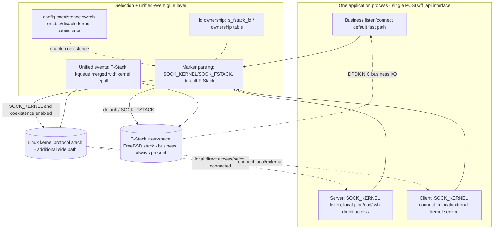

# 04 Architecture Design: F-Stack + Kernel Stack COEXISTENCE + per-fd marker selection + unified events

> **Document ID**: SPEC-KE-04
> **Version**: v5 (compile-macro gating)
> **Date**: 2026-06-17
> **Status**: Drafting

> **v5 sync (key points; see `zh_cn/04-architecture-design.md` for full detail)**: dual-layer switch — compile macro `FF_KERNEL_COEXIST` gates compile-time (off by default → coexistence code not compiled → byte-for-byte zero regression), config `[stack] kernel_coexist` gates runtime (effective only when the macro is on). `SOCK_*` markers are opt-in (APP must define the macro). Native coexistence is **already implemented** (not "new design"): fd discrimination via `FF_KERNEL_FD_BASE` encode offset + `ff_epoll_pairs[64]` pairing table (NOT enum/ownership-table, D6). Routing covers 13 entries only; `ff_readv/writev/send/recv/getpeername/getsockname/shutdown/ioctl/sendmsg/recvmsg` not covered (D8 known limitation).
> **Scope**: The coexistence architecture, the selection model, dual-stack unified events, the client/server bidirectional data flow, and both hook and native modes.
> **Basis**: `02` (code current state), `03` (external solutions); on conflict, code is authoritative.

---

## 1. Design Principles

1. **F-Stack always present (iron rule NFR-3)**: the application as a whole runs on F-Stack (`ff_init`/`ff_run` or LD_PRELOAD + an fstack instance); the business fast path **always** uses the F-Stack user-space stack; the kernel stack is merely an **additional** per-fd side path and **never** replaces/bypasses the F-Stack business plane.
2. **Reuse rather than rebuild**: hook-mode `FF_KERNEL_EVENT` (`02 §2`) already implements coexistence and is solidified as the primary baseline; nginx `kernel_network_stack` (`02 §3`) is an isomorphic reference.
3. **per-fd marker selection**: `socket()`/`ff_socket()`'s `type` with `SOCK_KERNEL` → kernel stack; default/`SOCK_FSTACK` → F-Stack. `SOCK_FSTACK` takes priority (when both set, F-Stack, `ff_hook_socket:387`).
4. **config coexistence-capability switch (coarse-grained, per-process)**: only controls "whether kernel-stack coexistence is enabled"; **does not change the default per-fd F-Stack semantics**; **no "whole-process default-to-kernel" option**.
5. **fd ownership + unified events**: ownership is fixed at creation; subsequent syscalls/events route by ownership; a single event loop merges F-Stack kqueue events + kernel epoll events.
6. **Default zero-overhead / zero regression**: when coexistence is not enabled or on the default/`SOCK_FSTACK` path, behavior is byte-for-byte identical to the original F-Stack (NFR-1).
7. **Unrelated to KNI**: no packet reinjection involved.

---

## 2. Overall Architecture (dual-stack coexistence within one process)



- **The business path (A1→F) is always F-Stack**; the kernel path (A2/A3→K) is a per-fd additional side path.
- hook mode: MK=`ff_hook_socket:387-390`, OWN=`is_fstack_fd:309`/`CHECK_FD_OWNERSHIP:57-61`, EV=`fstack_kernel_fd_map:257-258`+merge `:2324+`.
- native mode: MK/OWN/EV are this round's new design (lib-internal fd-ownership table + managed kernel fd + `ff_epoll_wait` merge), see §5.

---

## 3. Selection Model

### 3.1 Selection decision
```
if coexistence not enabled         -> all F-Stack (equivalent to original F-Stack, NFR-1)
otherwise per-fd:
   type has SOCK_KERNEL and !SOCK_FSTACK -> kernel stack (managed kernel fd)
   otherwise (default / SOCK_FSTACK)      -> F-Stack user-space stack
```
- **No "whole-process default-to-kernel"**: the coexistence switch only decides "whether the kernel side-path may be used"; the default is always per-fd F-Stack.

### 3.2 Selection implementation paradigm (hook: reuse code)
```c
/* ff_hook_socket (implemented, solidified reuse) */
if (fstack_territory(domain,type,proto)==0) return ff_linux_socket(...);   /* not the domain → kernel */
if ((type & SOCK_KERNEL) && !(type & SOCK_FSTACK)) {                       /* kernel stack */
    type &= ~SOCK_KERNEL; return ff_linux_socket(...);
}
type &= ~SOCK_FSTACK; /* → F-Stack business stack */
```

### 3.3 Isomorphic reference (nginx)
The process runs on F-Stack; a per-server `kernel_network_stack` → `belong_to_host`; dual event backends (kqueue primary + Linux epoll `ngx_ff_host_event_actions`) coexist in the same worker (`02 §3`) — proving the "same-process dual-stack + dual event backends" paradigm is mature and feasible.

---

## 4. Bidirectional Data Flow (coexistence)

### 4.1 Server direction
1. Business listen: `socket()` (default/`SOCK_FSTACK`) → F-Stack fd → `bind/listen` land on F-Stack → serve business via the DPDK NIC.
2. Kernel listen (coexisting): `socket(...|SOCK_KERNEL)` → managed kernel fd → `bind/listen` land on the kernel stack → local `ping`/`curl <kernel IP:port>` reach it directly, `accept` returns a kernel fd.
3. **Both kinds of listeners coexist in one process**, each stack's events delivered in the same epoll loop.

### 4.2 Client direction
1. Business client: default/`SOCK_FSTACK` → F-Stack fd → `connect` via F-Stack (DPDK NIC).
2. Kernel client (coexisting): `socket(...|SOCK_KERNEL)` → managed kernel fd → `connect` (`ff_hook_connect:858` by ownership) → `ff_linux_connect:144` → reaches 127.0.0.1/host IP/external kernel service.
3. Subsequent `send/recv/close` auto-split by ownership.

> Key: client and server share the "marker fixes the stack at creation, then route by ownership" mechanism; the business is always F-Stack, the kernel is an additional side path.

---

## 5. Dual-Stack Unified Event Model

### 5.1 Hook mode (reuse)
- External epoll; F-Stack side kqueue, kernel side epoll; `fstack_kernel_fd_map:257-258` maps F-Stack epoll fd ↔ kernel epoll fd.
- One `wait`: first take kernel events with `timeout=0`+throttle (`:2324+`/`:2333-2336`), then merge F-Stack events (`maxevents>=2` `:2212-2218`).
- `close` linkage releases both stacks' fds (`:1874-1883`).

### 5.2 Native mode (new design)
- A new fd-ownership scheme (a managed kernel fd is `host_fd + FF_KERNEL_FD_BASE`, above the FreeBSD fd range, so the two never collide).
- `ff_socket(SOCK_KERNEL)` creates a **managed kernel fd** via `ff_host_interface` (registered for ownership, not exposing a raw bypass).
- `ff_epoll_create` returns the F-Stack kqueue; a host epoll is lazily created and paired when a kernel fd is first added.
- `ff_epoll_ctl`: kernel fd → host `epoll_ctl` on the paired host epoll; F-Stack fd → `ff_kevent`.
- `ff_epoll_wait`: first poll the host epoll with `timeout=0` (non-blocking), then `ff_kevent_do_each` for F-Stack events, merging the results.
- `ff_close` releases by ownership and clears the ownership entry.
- The default/`SOCK_FSTACK` path goes entirely through the original `ff_socket`/`ff_epoll.c`, byte-for-byte zero regression.

---

## 6. Kernel - User-Space Stack Coexistence Matrix

| Dimension | F-Stack user-space stack (business, default) | Kernel stack (additional side path) |
|---|---|---|
| Carrier | DPDK PMD + FreeBSD stack | Linux kernel protocol stack |
| Traffic | Business fast path | Local/management/client connecting to local or external kernel services |
| Selection trigger | default / `SOCK_FSTACK` | `SOCK_KERNEL` (requires coexistence enabled) |
| Events | `ff_kqueue`/`ff_kevent` | `epoll` (host) |
| Can it be bypassed | **No (always present)** | Additional only, can be disabled |

---

## 7. Selection and Trade-offs

| Option | Adopted? | Reason |
|---|---|---|
| **Solidify hook FF_KERNEL_EVENT coexistence** | ✓ **primary baseline** | Already implements coexistence (`02 §2`), app on F-Stack + per-fd kernel side path |
| **Native ff_api unified-event coexistence** | ✓ **new design** | Lets natively-linked applications also coexist over both stacks in one process |
| **nginx kernel_network_stack** | ✓ reference | Isomorphic dual event backends, proves feasibility |
| v3 `ff_host_socket` raw kernel bypass | ✗ **deprecated** | Bypasses F-Stack, violates the coexistence iron rule (NFR-3) |
| whole-process `default_stack=kernel` | ✗ **deprecated** | anti-F-Stack |
| `ff_local_*` dual API / thread-level selection / KNI reinjection | ✗ | does not match the requirement / out of the problem domain |

**Conclusion**: with **hook FF_KERNEL_EVENT coexistence as the primary baseline + native unified-event coexistence as the new design** as the skeleton, per-fd markers + a config coexistence switch, covering server/client directions and hook/native modes, with F-Stack always present.

---

## 8. Blast Radius
- This phase (R1): docs only.
- Implementation phase: (a) hook mode re-verify/solidify + a correct coexistence demo (small change, mostly reuse); (b) lib adds native unified-event coexistence (fd-ownership table + managed kernel fd + `ff_epoll_*` merge, concentrated in `ff_epoll.c`/`ff_syscall_wrapper.c ff_socket`/`ff_host_interface` managed bridge); (c) `ff_config.{c,h}` coexistence-capability switch; the default path has zero regression, avoiding the packet fast-path hotspots.

---

## 9. Open Questions (deferred to 05/06)
- The concrete data structures and placement of the native unified-event ownership table and managed kernel fd (`ff_epoll.c` vs a new file).
- The config coexistence switch naming (`[stack] kernel_coexist=0/1`, etc.) and default value (default off).
- The fd-space distinction between native managed kernel fds and F-Stack fds (mimic the nginx `ngx_max_sockets` offset / mimic the hook encoded offset).
