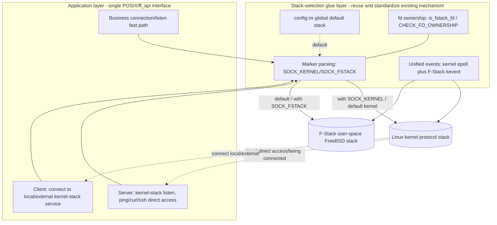

# 04 Architecture Design: Marker-Driven Stack Selection + config default switch + glue auto-adaptation

> **Document ID**: SPEC-KE-04
> **Version**: v3 (paradigm-correction rework)
> **Date**: 2026-06-15
> **Status**: Drafting
> **Scope**: The architecture of this feature, the stack-selection model (markers + config), the client/server bidirectional data flow, dual-stack coexistence, and unified events.
> **Basis**: `02` (code current state), `03` (external solutions); on conflict, code is authoritative.

---

## 1. Design Principles

1. **Reuse rather than rebuild**: base it on F-Stack hook mode's existing "**single POSIX API + `SOCK_KERNEL`/`SOCK_FSTACK` markers**" (`02 §2`); **do not create a new `ff_local_*` dual API, do not introduce a `belong_to_host` parameter**.
2. **Two-level selection by markers + config**:
   - **app marker** (fine-grained, per-fd): `socket()`/`ff_socket()`'s `type` carries `SOCK_KERNEL`/`SOCK_FSTACK`.
   - **config.ini global default** (coarse-grained, per-process): one switch sets this process's default stack.
   - **Priority: app marker > config default > built-in default (F-Stack)**.
3. **Glue auto-adaptation**: stack selection fixes fd ownership at socket creation; subsequent `bind/listen/accept/connect/read/write/close/epoll` are **auto-routed** by the glue layer (`CHECK_FD_OWNERSHIP`/`is_fstack_fd`), transparently to the application.
4. **Multi-process rather than multi-thread**: differentiated default stacks rely on **different processes with different config files** (`02 §4`), **not thread-level selection**.
5. **Default zero-overhead**: when the compile switch is off / default F-Stack, it is fully equivalent to pure F-Stack.
6. **Unrelated to KNI**: no packet reinjection involved.

---

## 2. Overall Architecture



- **Marker-parsing layer** (reuses `ff_hook_socket:387-390`): decides whether the new fd lands on the kernel stack or F-Stack based on the `type` markers + config default.
- **fd-ownership layer** (reuses `is_fstack_fd:309` + `CHECK_FD_OWNERSHIP:57-61`): all subsequent syscalls auto-split by ownership.
- **Unified-event layer** (reuses `fstack_kernel_fd_map:257-258` + dual-stack epoll merge `:2324+`).

---

## 3. Stack-Selection Model

### 3.1 Two-level selection and priority
| Level | Carrier | Granularity | Source/landing point |
|---|---|---|---|
| **app marker** | `SOCK_KERNEL`/`SOCK_FSTACK` on `socket()` type | per-fd | `ff_adapter.h:7-8`, `ff_hook_socket:387-390` |
| **config default** | config.ini global switch | per-process | mimic `[kni]`: `ff_config.c:1011`/`ff_config.h:310-319` |
| **built-in default** | when neither configured nor marked | global | currently defaults to F-Stack (`ff_hook_socket` default branch :406) |

**Decision**: `stack = app_marker ?? config_default ?? F-Stack`.

### 3.2 Selection implementation paradigm (reuse code, not new build)
```c
/* hook mode (implemented, directly reused): ff_hook_socket */
if (fstack_territory(domain,type,proto)==0) return ff_linux_socket(...);   /* not the domain → kernel */
if ((type & SOCK_KERNEL) && !(type & SOCK_FSTACK)) {                       /* explicit/default kernel */
    type &= ~SOCK_KERNEL; return ff_linux_socket(...);
}
type &= ~SOCK_FSTACK; /* → F-Stack */
```
- **config default injection point**: when the app carries no marker, the glue layer adds an equivalent `SOCK_KERNEL` before/inside entering `ff_hook_socket` based on `ff_global_cfg.stack.default_to_kernel` (refined in the implementation phase).
- **Native-mode enhancement** (`02 §5`, currently `ff_socket` does not recognize markers): add a `SOCK_KERNEL` recognition branch at the `ff_socket` entry, mimicking hook → route to the equivalent kernel-socket path; keep a single API.

### 3.3 Isomorphic corroboration (kept)
nginx mechanism A: `ngx_event_connect.c:46-50` (`type|SOCK_FSTACK` vs an ordinary socket), `ngx_http.c:1890` — proves the "per-socket marker-based selection + an independent kernel-side event backend" paradigm is feasible.

---

## 4. Bidirectional Data Flow (v3 focus)

### 4.1 Server direction (local direct access to F-Stack host services)
1. The app creates a listening socket (with `SOCK_KERNEL` or default kernel stack) → kernel fd.
2. `bind/listen` land on the kernel stack via `CHECK_FD_OWNERSHIP`.
3. Local `ping`/`curl <kernel-stack IP:port>` directly reach it via the kernel stack; `accept` returns a kernel fd.

### 4.2 Client direction (newly added: connect to local/external kernel-stack services)
1. The app creates a client socket:
   - To connect to a **local loopback / host kernel-stack IP service** or an **external kernel-stack service** → with `SOCK_KERNEL` (or default kernel stack) → kernel fd.
   - To connect to an F-Stack fast-path business peer → default/`SOCK_FSTACK` → F-Stack fd.
2. `connect` (`ff_hook_connect:858`) is **routed purely by fd ownership**: kernel fd → `ff_linux_connect:144` (reachable to 127.0.0.1/host IP/external kernel service); F-Stack fd → F-Stack connect.
3. Subsequent `send/recv/close` likewise auto-split by ownership.

> Key: client and server share the same "marker fixes the stack at creation time, then route by ownership" mechanism; different directions but identical implementation.

---

## 5. Dual-Stack Unified Event Model (reuse the mechanism)

- F-Stack native: kqueue/kevent (`ff_api.h:138-139`); kernel stack: epoll.
- Externally unified epoll style; internally maintain a "unified epoll fd → kernel epoll fd" mapping (reuse `fstack_kernel_fd_map:257-258`).
- One `wait`: first take kernel events with `timeout=0` (can be throttled, `:2324+`), then take and merge F-Stack events (`maxevents>=2`, `:2212-2218`).
- `close` linkage releases both stacks' fds (`:1874-1883`).

---

## 6. Kernel - User-Space Stack Coexistence

| Dimension | F-Stack user-space stack | Kernel stack |
|---|---|---|
| Carrier | DPDK PMD + FreeBSD stack | Linux kernel protocol stack |
| Traffic | Business fast path | Local/management/client connecting to local or external kernel-stack services (ping/curl/ssh/connect) |
| Selection trigger | default / `SOCK_FSTACK` | `SOCK_KERNEL` / config default kernel |
| Events | `ff_kqueue`/`ff_kevent` | `epoll` |

---

## 7. Selection and Trade-offs

| Option | Adopted? | Reason |
|---|---|---|
| **Reuse existing single API + marker-based selection** | ✓ **primary** | Hook mode already implemented (`02 §2`), the application needs no multiple API sets; matches the user's requirement |
| **config.ini global default switch** | ✓ **primary** | Process-level default stack, mimics the `[kni]` paradigm, multi-process relies on different config files |
| **Dual-stack epoll merge** | ✓ **primary** | A single event loop serves both stacks |
| New `ff_local_*` dual API (v2) | ✗ | mTCP-like dual namespace, the application must switch to multiple API sets — explicitly rejected by the user |
| gazelle thread-level selection | ✗ | F-Stack multi-process model, using different config files suffices, no thread-level needed |
| config port/address lists | ✗ | The user only wants "one global default switch", fine-grained left to markers |
| KNI / virtio-user packet reinjection | ✗ | Not in this problem domain; `rte_kni` has been removed |

**Conclusion**: with **existing single API + `SOCK_KERNEL`/`SOCK_FSTACK` markers** + **config.ini global default switch** + **dual-stack event merging** as the skeleton, cover both server and client directions and both hook and native modes.

---

## 8. Blast Radius
- This phase: only add/revise documents, zero source changes.
- Subsequent implementation phase: (a) standardize the marker convention (expose `SOCK_KERNEL`/`SOCK_FSTACK` in an external header); (b) add the global default-stack switch field and parsing in `lib/ff_config.{c,h}`; (c) add a marker recognition branch in native `ff_socket` (`02 §5`); (d) the client `connect` path is already naturally supported (only document the usage). Changes are concentrated, avoiding the packet fast-path hotspots.

---

## 9. Open Questions (deferred to 05/06 for refinement)
- The config.ini switch naming and which section it belongs to (a new `[stack]` section vs merging into `[dpdk]`).
- The specific location of the native-mode marker recognition enhancement (`ff_socket` entry vs a separate wrapper).
- Whether to additionally provide an "explicit kernel-stack convenience wrapper" externally or only expose the marker convention.
