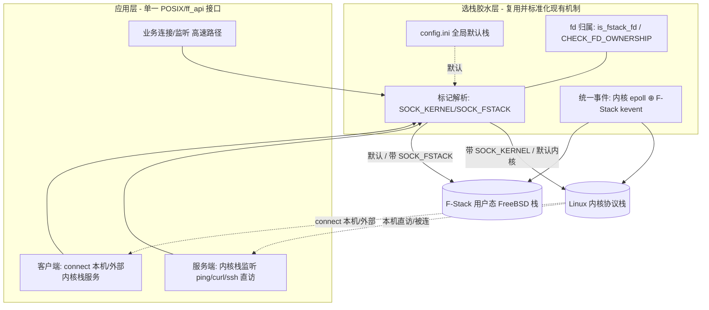

# 04 架构设计：标记驱动选栈 + config 默认开关 + 胶水自动适配

> **文档编号**：SPEC-KE-04
> **版本**：v3（范式修正重做）
> **日期**：2026-06-15
> **状态**：编写中
> **作用域**：本特性的架构、选栈模型（标记 + 配置）、客户端/服务端双向数据流、双栈共存与统一事件。
> **依据**：`02`（代码现状）、`03`（外部方案），冲突以代码为准。

---

## 1. 设计原则

1. **复用而非重造**：以 F-Stack hook 模式现有"**单 POSIX API + `SOCK_KERNEL`/`SOCK_FSTACK` 标记**"为基座（`02 §2`），**不新造 `ff_local_*` 双 API、不引入 `belong_to_host` 参数**。
2. **标记 + 配置两级选栈**：
   - **app 标记**（细粒度，per-fd）：`socket()`/`ff_socket()` 的 `type` 带 `SOCK_KERNEL`/`SOCK_FSTACK`。
   - **config.ini 全局默认**（粗粒度，per-process）：一个开关定本进程默认栈。
   - **优先级：app 标记 > config 默认 > 内置默认（F-Stack）**。
3. **胶水自动适配**：选栈在 socket 创建时确定 fd 归属，后续 `bind/listen/accept/connect/read/write/close/epoll` 由胶水层（`CHECK_FD_OWNERSHIP`/`is_fstack_fd`）**自动路由**，应用无感知。
4. **多进程而非多线程**：差异化默认栈靠**不同进程不同 config 文件**（`02 §4`），**不做线程级选栈**。
5. **默认零开销**：编译开关默认关闭/默认 F-Stack 时完全等价纯 F-Stack。
6. **与 KNI 无关**：不涉及报文回灌。

---

## 2. 总体架构



- **标记解析层**（复用 `ff_hook_socket:387-390`）：按 `type` 标记 + config 默认决定新 fd 落内核栈或 F-Stack。
- **fd 归属层**（复用 `is_fstack_fd:309` + `CHECK_FD_OWNERSHIP:57-61`）：后续所有 syscall 按归属自动分流。
- **统一事件层**（复用 `fstack_kernel_fd_map:257-258` + 双栈 epoll 合并 `:2324+`）。

---

## 3. 选栈模型

### 3.1 两级选栈与优先级
| 层级 | 载体 | 粒度 | 来源/落点 |
|---|---|---|---|
| **app 标记** | `socket()` type 上的 `SOCK_KERNEL`/`SOCK_FSTACK` | per-fd | `ff_adapter.h:7-8`、`ff_hook_socket:387-390` |
| **config 默认** | config.ini 全局开关 | per-process | 仿 `[kni]`：`ff_config.c:1011`/`ff_config.h:310-319` |
| **内置默认** | 不配不标记时 | 全局 | 现状默认 F-Stack（`ff_hook_socket` 默认分支 :406） |

**决策**：`选栈 = app标记 ?? config默认 ?? F-Stack`。

### 3.2 选栈实现范式（复用代码，非新造）
```c
/* hook 模式（已实现，直接复用）：ff_hook_socket */
if (fstack_territory(domain,type,proto)==0) return ff_linux_socket(...);   /* 非领域 → 内核 */
if ((type & SOCK_KERNEL) && !(type & SOCK_FSTACK)) {                       /* 显式/默认内核 */
    type &= ~SOCK_KERNEL; return ff_linux_socket(...);
}
type &= ~SOCK_FSTACK; /* → F-Stack */
```
- **config 默认注入点**：当 app 未带标记时，胶水层依据 `ff_global_cfg.stack.default_to_kernel` 在进入 `ff_hook_socket` 前/内补上等价 `SOCK_KERNEL`（实现阶段细化）。
- **原生模式补强**（`02 §5`，现状 `ff_socket` 不识别标记）：在 `ff_socket` 入口仿 hook 增加 `SOCK_KERNEL` 识别分支 → 走内核 socket 等价路径；保持单 API。

### 3.3 同构旁证（保留）
nginx 机制 A：`ngx_event_connect.c:46-50`（`type|SOCK_FSTACK` vs 普通 socket）、`ngx_http.c:1890`——证明"per-socket 标记选栈 + 内核侧独立事件后端"范式可行。

---

## 4. 双向数据流（v3 重点）

### 4.1 服务端方向（本机直访 F-Stack 主机服务）
1. app 创建监听 socket（带 `SOCK_KERNEL` 或默认内核栈）→ 内核 fd。
2. `bind/listen` 经 `CHECK_FD_OWNERSHIP` 落内核栈。
3. 本机 `ping`/`curl <内核栈IP:port>` 经内核栈直达；`accept` 返回内核 fd。

### 4.2 客户端方向（新增：connect 本机/外部内核栈服务）
1. app 创建客户端 socket：
   - 连**本机回环/本机内核栈 IP 服务** 或 **外部内核栈服务** → 带 `SOCK_KERNEL`（或默认内核栈）→ 内核 fd。
   - 连 F-Stack 高速业务对端 → 默认/`SOCK_FSTACK` → F-Stack fd。
2. `connect`（`ff_hook_connect:858`）**纯按 fd 归属路由**：内核 fd → `ff_linux_connect:144`（可达 127.0.0.1/本机 IP/外部内核服务）；F-Stack fd → F-Stack connect。
3. 后续 `send/recv/close` 同样按归属自动分流。

> 关键：客户端与服务端共用同一套"创建时标记定栈、后续按归属路由"机制，方向不同但实现一致。

---

## 5. 双栈统一事件模型（复用机制）

- F-Stack 原生：kqueue/kevent（`ff_api.h:138-139`）；内核栈：epoll。
- 对外统一 epoll 风格；内部维护"统一 epoll fd → 内核 epoll fd"映射（复用 `fstack_kernel_fd_map:257-258`）。
- 一次 `wait`：先 `timeout=0` 取内核事件（可节流，`:2324+`），再取 F-Stack 事件合并（`maxevents>=2`，`:2212-2218`）。
- `close` 联动释放两栈 fd（`:1874-1883`）。

---

## 6. 内核-用户态栈共存

| 维度 | F-Stack 用户态栈 | 内核栈 |
|---|---|---|
| 载体 | DPDK PMD + FreeBSD 栈 | Linux 内核协议栈 |
| 流量 | 业务高速路径 | 本机/管理/客户端连本机或外部内核服务（ping/curl/ssh/connect） |
| 选栈触发 | 默认 / `SOCK_FSTACK` | `SOCK_KERNEL` / config 默认内核 |
| 事件 | `ff_kqueue`/`ff_kevent` | `epoll` |

---

## 7. 选型与权衡

| 方案 | 是否采用 | 理由 |
|---|---|---|
| **复用现有单 API + 标记选栈** | ✓ **主选** | hook 模式已实现（`02 §2`），应用无需多套 API；契合用户诉求 |
| **config.ini 全局默认开关** | ✓ **主选** | 进程级默认栈，仿 `[kni]` 范式，多进程靠不同配置文件 |
| **双栈 epoll 合并** | ✓ **主选** | 单事件循环服务两栈 |
| 新造 `ff_local_*` 双 API（v2） | ✗ | 类 mTCP 双命名空间，应用需改用多套 API——用户明确否决 |
| gazelle 线程级选栈 | ✗ | F-Stack 多进程模型，用不同 config 文件即可，无需线程级 |
| config 端口/地址名单 | ✗ | 用户只要"一个全局默认开关"，细粒度交给标记 |
| KNI / virtio-user 报文回灌 | ✗ | 非本问题域；`rte_kni` 已移除 |

**结论**：以**现有单 API + `SOCK_KERNEL`/`SOCK_FSTACK` 标记** + **config.ini 全局默认开关** + **双栈事件合并**为骨架，覆盖服务端与客户端双向、hook 与原生双模式。

---

## 8. 影响面（blast radius）
- 本阶段：仅新增/修订文档，零源码改动。
- 后续实现阶段：(a) 标准化标记约定（对外头文件暴露 `SOCK_KERNEL`/`SOCK_FSTACK`）；(b) `lib/ff_config.{c,h}` 新增全局默认栈开关字段与解析；(c) 原生 `ff_socket` 补标记识别分支（`02 §5`）；(d) 客户端 `connect` 路径已天然支持（仅文档化用法）。改动集中、避免触碰报文快路径热点。

---

## 9. 待决问题（交 05/06 细化）
- config.ini 开关命名与所属段（新 `[stack]` 段 vs 并入 `[dpdk]`）。
- 原生模式标记识别补强的具体位置（`ff_socket` 入口 vs 独立封装）。
- 对外是否额外提供"显式内核栈便捷封装"还是仅暴露标记约定。
