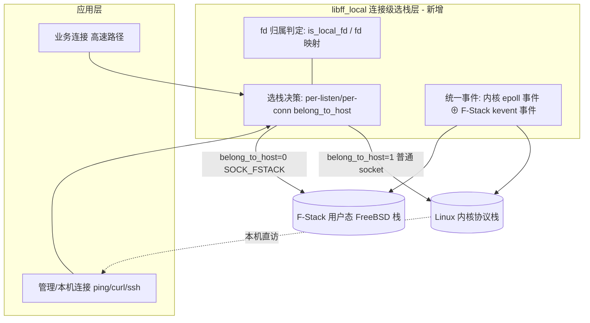

# 04 架构设计：连接级选栈 + 双栈统一事件模型

> **文档编号**：SPEC-KE-04
> **版本**：v2（全量重做）
> **日期**：2026-06-15
> **状态**：编写中
> **作用域**：本特性 lib 的架构、选栈模型、双栈共存与事件统一设计。
> **依据**：`02-current-state-analysis.md`（代码现状）、`03-external-research.md`（外部方案），冲突以代码为准。

---

## 1. 设计原则

1. **连接级选栈为核心**：以机制 A 的 1-bit `belong_to_host` 选栈为范式，**与 KNI/报文回灌完全无关**。
2. **复用而非重造**：内核栈侧用原生 Linux `socket/epoll`，F-Stack 侧复用 `ff_api.h` 的 `ff_*`，lib 只做"选栈 + 归属判定 + 事件合并"的薄封装。
3. **默认零开销**：编译开关 `FF_LOCAL_STACK`（暂名）默认关闭，关闭时完全等价于纯 F-Stack。
4. **应用无关**：不绑定 nginx / LD_PRELOAD；既支持源码集成，也为后续 LD_PRELOAD 透明接管预留空间。

---

## 2. 总体架构



- **选栈决策层**：借鉴机制 A——在 `socket()`/`listen()` 时按标志决定走内核栈（普通 `socket`）还是 F-Stack（`ff_socket`，即 `SOCK_FSTACK` 语义）。
- **fd 归属判定层**：借鉴机制 B 的 `is_fstack_fd`（`ff_hook_syscall.c:309`），lib 内维护"本特性 fd → 内核 fd / F-Stack fd"的归属，使后续 `read/write/close/epoll` 自动分流。
- **统一事件层**：借鉴机制 B 的 `fstack_kernel_fd_map`（`:257-258`）+ 双栈 epoll 合并（`:2329-2338`），把内核 epoll 事件与 F-Stack kevent 事件合并为应用可见的统一事件集。

---

## 3. 连接级选栈模型

### 3.1 选栈粒度
| 粒度 | 来源范式 | 说明 |
|---|---|---|
| **监听级** | 机制 A `ngx_http.c:1890` | 创建监听时声明该监听归内核栈或 F-Stack（首选粒度） |
| **连接级** | 机制 A `ngx_event_connect.c:46-50` | 主动 `connect` 时按标志选栈 |
| **线程级**（可选） | gazelle `GAZELLE_THREAD_NAME` | 某线程整体走内核栈（备选范式，见 `03`） |

### 3.2 选栈实现范式（借鉴机制 A）
```c
/* 伪代码：lib 内部 */
if (belong_to_host)        /* 走内核栈：本机可直访 */
    fd = socket(af, type, 0);          /* 原生 Linux socket */
else                       /* 走 F-Stack：业务高速路径 */
    fd = ff_socket(af, type, 0);       /* 对应 SOCK_FSTACK 语义 */
```
对照两机制的同构实现：
- 机制 A `ngx_event_connect.c:46-50`：`type|SOCK_FSTACK`（走 F-Stack）vs 普通 `socket`（走内核）。
- 机制 B `ff_hook_socket:387-390` + `ff_adapter.h:7-8`：`SOCK_KERNEL`（显式走内核）/ `SOCK_FSTACK`（走 F-Stack）两标志。

> 即 lib 的 `belong_to_host` 内部可直接映射为"内核侧普通 socket / `SOCK_KERNEL`"或"`ff_socket` / `SOCK_FSTACK`"。

---

## 4. 双栈统一事件模型（借鉴机制 B）

### 4.1 事件模型差异
- F-Stack 原生：**kqueue/kevent**（`ff_api.h:138-139` `ff_kqueue`/`ff_kevent`）。
- 内核栈：**epoll**（或 select/poll）。
- lib 需在接口层抹平：对外暴露统一 epoll 风格 API，内部对 F-Stack fd 走 `ff_kevent`、对内核 fd 走内核 `epoll_wait`，再合并。

### 4.2 事件合并范式（借鉴机制 B `:2329-2338`）
1. lib 维护"统一 epoll fd → {F-Stack 事件源, 内核 epoll fd}"映射（类比 `fstack_kernel_fd_map`）。
2. 一次 `wait`：
   - 先以 `timeout=0` 取内核 epoll 事件（可节流，如机制 B 每 N 次取一次以控延迟，`ff_hook_syscall.c:2333-2336`）。
   - 再取 F-Stack 事件。
   - 合并到同一 `events[]` 返回（需满足 `maxevents>=2`，对照 `:2212-2218`）。
3. `close` 时联动释放两栈 fd（对照 `:1874-1883`）。

### 4.3 fd 归属判定
- lib 维护 fd 归属表（或沿用机制 B 的 fd 编码偏移 + `is_fstack_fd` 范式），使 `read/write/close/epoll_ctl` 自动路由到正确栈。

---

## 5. 内核-用户态栈共存模型

| 维度 | F-Stack 用户态栈 | 内核栈 |
|---|---|---|
| 载体 | DPDK PMD + FreeBSD 栈 | Linux 内核协议栈 |
| 流量 | 业务高速路径 | 本机/管理/异常路径（ping/curl/ssh） |
| socket | `ff_socket`（`SOCK_FSTACK`） | 原生 `socket` |
| 事件 | `ff_kqueue`/`ff_kevent` | `epoll` |
| 选栈触发 | `belong_to_host=0`（默认） | `belong_to_host=1` |

---

## 6. 选型与权衡

| 方案 | 是否采用 | 理由 |
|---|---|---|
| **连接级选栈（机制 A 范式）** | ✓ **主选** | 直接命中"应用在内核侧暴露服务"，F-Stack 已验证可行 |
| **双栈 epoll 合并（机制 B 范式）** | ✓ **主选** | 解决单事件循环服务两栈 |
| 线程级选栈（gazelle 范式） | △ 备选 | 粒度较粗，作为可选模式 |
| KNI / `rte_kni` | ✗ | DPDK 23.11 已移除；gazelle 亦衰退；非本特性问题域 |
| virtio-user / TAP 报文回灌 | ✗ | 解决"裸报文回内核"，非"应用在内核侧暴露服务" |
| AF_XDP | ✗ | 与"DPDK 完全接管网卡"模型不契合 |

**结论**：以**机制 A 的连接级选栈** + **机制 B 的双栈事件合并**为骨架，封装为应用无关 lib。

---

## 7. 影响面（blast radius）
- 本阶段：仅新增文档，零源码改动。
- 后续实现阶段：新增 `lib/ff_local.{h,c}`（独立编译单元，`FF_LOCAL_STACK` 开关）；对 `lib/` 现有代码尽量只做接口暴露式改动，不触碰报文快路径热点。

---

## 8. 待决问题（交 05/06 细化）
- 统一 API 命名与归属：扩展 `lib/ff_api.h` vs 新增 `lib/ff_local.h`。
- 事件模型对外形态：统一 epoll 风格 vs 同时暴露 kqueue 与 epoll。
- 选栈声明方式：API 参数标志 vs 配置项 vs 线程级环境变量。
- 内核侧事件后端是否复用机制 A 的 `ngx_ff_host_event_actions` 思路独立实现。
