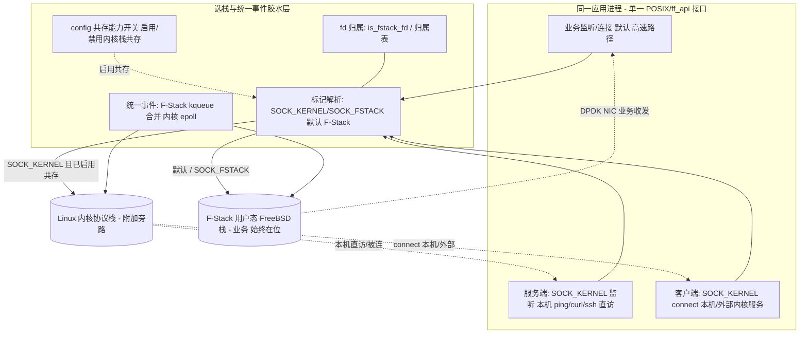

# 04 架构设计：F-Stack + 内核栈「共存」+ per-fd 标记选栈 + 统一事件

> **文档编号**：SPEC-KE-04
> **版本**：v4（共存范式返工重写）
> **日期**：2026-06-16
> **状态**：编写中
> **作用域**：共存架构、选栈模型、双栈统一事件、客户端/服务端双向数据流、hook 与原生双模式。
> **依据**：`02`（代码现状）、`03`（外部方案），冲突以代码为准。

---

## 1. 设计原则

1. **F-Stack 始终在位（铁律 NFR-3）**：应用整体 on F-Stack（`ff_init`/`ff_run` 或 LD_PRELOAD + fstack 实例），业务高速路径**永远**走 F-Stack 用户态栈；内核栈只是 per-fd **附加**的旁路通道，**绝不替代/旁路 F-Stack**。
2. **复用而非重造**：hook 模式 `FF_KERNEL_EVENT`（`02 §2`）已实现共存，固化为主基线；nginx `kernel_network_stack`（`02 §3`）为同构参考。
3. **per-fd 标记选栈**：`socket()`/`ff_socket()` 的 `type` 带 `SOCK_KERNEL` → 内核栈；默认/`SOCK_FSTACK` → F-Stack。`SOCK_FSTACK` 优先（同置走 F-Stack，`ff_hook_socket:387`）。
4. **config 共存能力开关（粗粒度，per-process）**：仅控制「是否启用内核栈共存」，**不改变默认 per-fd F-Stack 语义**，**无「整进程默认内核」选项**。
5. **fd 归属 + 统一事件**：创建时定 fd 归属，后续 syscall/事件按归属自动路由；单事件循环合并 F-Stack kqueue 事件 + 内核 epoll 事件。
6. **默认零开销/零回归**：未启用共存或默认/`SOCK_FSTACK` 路径与原 F-Stack 逐字节一致（NFR-1）。
7. **与 KNI 无关**：不涉及报文回灌。

---

## 2. 总体架构（同一进程内双栈共存）



- **业务路径（A1→F）始终是 F-Stack**；内核路径（A2/A3→K）是 per-fd 附加旁路。
- hook 模式：MK=`ff_hook_socket:387-390`，OWN=`is_fstack_fd:309`/`CHECK_FD_OWNERSHIP:57-61`，EV=`fstack_kernel_fd_map:257-258`+合并 `:2324+`。
- 原生模式：MK/OWN/EV 为本轮新设计（lib 内 fd 归属表 + 受管内核 fd + `ff_epoll_wait` 合并），见 §5。

---

## 3. 选栈模型

### 3.1 选栈决策
```
若 未启用共存          -> 全部 F-Stack（等价原 F-Stack，NFR-1）
否则 per-fd:
   type 带 SOCK_KERNEL 且 !SOCK_FSTACK -> 内核栈（受管内核 fd）
   否则（默认 / SOCK_FSTACK）          -> F-Stack 用户态栈
```
- **无「整进程默认内核」**：共存开关只决定「能否使用内核旁路」，默认始终 per-fd F-Stack。

### 3.2 选栈实现范式（hook：复用代码）
```c
/* ff_hook_socket（已实现，固化复用） */
if (fstack_territory(domain,type,proto)==0) return ff_linux_socket(...);   /* 非领域 → 内核 */
if ((type & SOCK_KERNEL) && !(type & SOCK_FSTACK)) {                       /* 内核栈 */
    type &= ~SOCK_KERNEL; return ff_linux_socket(...);
}
type &= ~SOCK_FSTACK; /* → F-Stack 业务栈 */
```

### 3.3 同构参考（nginx）
进程 on F-Stack；per-server `kernel_network_stack` → `belong_to_host`；双事件后端（kqueue 主 + Linux epoll `ngx_ff_host_event_actions`）在同一 worker 共存（`02 §3`）——证明「同进程双栈 + 双事件后端」范式成熟可行。

---

## 4. 双向数据流（共存）

### 4.1 服务端方向
1. 业务监听：`socket()`（默认/`SOCK_FSTACK`）→ F-Stack fd → `bind/listen` 落 F-Stack → 经 DPDK NIC 服务业务。
2. 内核监听（共存）：`socket(...|SOCK_KERNEL)` → 受管内核 fd → `bind/listen` 落内核栈 → 本机 `ping`/`curl <内核IP:port>` 直达，`accept` 返回内核 fd。
3. **两类监听同进程并存**，各自事件在同一 epoll 循环投递。

### 4.2 客户端方向
1. 业务客户端：默认/`SOCK_FSTACK` → F-Stack fd → `connect` 走 F-Stack（DPDK NIC）。
2. 内核客户端（共存）：`socket(...|SOCK_KERNEL)` → 受管内核 fd → `connect`（`ff_hook_connect:858` 按归属）走 `ff_linux_connect:144` → 可达 127.0.0.1/本机 IP/外部内核服务。
3. 后续 `send/recv/close` 按归属自动分流。

> 关键：客户端与服务端共用「创建时标记定栈、后续按归属路由」机制；业务始终 F-Stack，内核为附加旁路。

---

## 5. 双栈统一事件模型

### 5.1 hook 模式（复用）
- 对外 epoll；F-Stack 侧 kqueue，内核侧 epoll；`fstack_kernel_fd_map:257-258` 建 F-Stack epoll fd↔内核 epoll fd 映射。
- 一次 `wait`：先 `timeout=0`+节流取内核事件（`:2324+`/`:2333-2336`），再合并 F-Stack 事件（`maxevents>=2` `:2212-2218`）。
- `close` 联动释放两栈 fd（`:1874-1883`）。

### 5.2 原生模式（新设计）
- 新建 fd 归属表（如 `int ff_native_kernel_fd[FF_MAX]`，仿 `fstack_kernel_fd_map`）。
- `ff_socket(SOCK_KERNEL)` 经 `ff_host_interface` 建**受管内核 fd**（登记归属，不暴露裸绕过）。
- `ff_epoll_create` 兼建一个内核 `epoll_create1`（宿主），与 F-Stack kqueue 配对。
- `ff_epoll_ctl`：内核 fd → 宿主 `epoll_ctl`；F-Stack fd → `ff_kevent`。
- `ff_epoll_wait`：先 `timeout=0` 取内核 epoll 事件（节流），再 `ff_kevent_do_each` 取 F-Stack 事件，合并返回。
- `ff_close` 按归属释放并清归属表。
- 默认/`SOCK_FSTACK` 路径完全走原 `ff_socket`/`ff_epoll.c`，逐字节零回归。

---

## 6. 内核-用户态栈共存矩阵

| 维度 | F-Stack 用户态栈（业务，默认） | 内核栈（附加旁路） |
|---|---|---|
| 载体 | DPDK PMD + FreeBSD 栈 | Linux 内核协议栈 |
| 流量 | 业务高速路径 | 本机/管理/客户端连本机或外部内核服务 |
| 选栈触发 | 默认 / `SOCK_FSTACK` | `SOCK_KERNEL`（需启用共存） |
| 事件 | `ff_kqueue`/`ff_kevent` | `epoll`（宿主） |
| 是否可被旁路 | **否（始终在位）** | 仅附加，可禁用 |

---

## 7. 选型与权衡

| 方案 | 是否采用 | 理由 |
|---|---|---|
| **hook FF_KERNEL_EVENT 共存固化** | ✓ **主基线** | 已实现共存（`02 §2`），应用 on F-Stack + per-fd 内核旁路 |
| **原生 ff_api 统一事件共存** | ✓ **新设计** | 让原生链接应用也能一进程双栈共存 |
| **nginx kernel_network_stack** | ✓ 参考 | 同构双事件后端，证明可行 |
| v3 `ff_host_socket` 纯内核旁路 | ✗ **已废弃** | 绕开 F-Stack，违背共存铁律（NFR-3） |
| 整进程 `default_stack=kernel` | ✗ **已废弃** | 反 F-Stack |
| `ff_local_*` 双 API / 线程级选栈 / KNI 回灌 | ✗ | 不符诉求/非本问题域 |

**结论**：以 **hook FF_KERNEL_EVENT 共存为主基线 + 原生统一事件共存为新设计** 为骨架，per-fd 标记 + config 共存开关，覆盖服务端/客户端双向、hook/原生双模式，F-Stack 始终在位。

---

## 8. 影响面（blast radius）
- 本阶段（R1）：仅文档。
- 实现阶段：(a) hook 模式复核固化 + 正确共存 demo（改动小，主要复用）；(b) lib 新增原生统一事件共存（fd 归属表 + 受管内核 fd + `ff_epoll_*` 合并，集中在 `ff_epoll.c`/`ff_syscall_wrapper.c ff_socket`/`ff_host_interface` 受管桥/新文件）；(c) `ff_config.{c,h}` 共存能力开关；默认路径零回归，避免触碰报文快路径热点。

---

## 9. 待决问题（交 05/06 细化）
- 原生统一事件共存的归属表与受管内核 fd 的具体数据结构与放置（`ff_epoll.c` vs 新文件）。
- config 共存开关命名（`[stack] kernel_coexist=0/1` 等）与默认值（默认关）。
- 原生模式受管内核 fd 与 F-Stack fd 的 fd 空间区分方式（仿 nginx `ngx_max_sockets` 偏移 / 仿 hook 编码偏移）。
