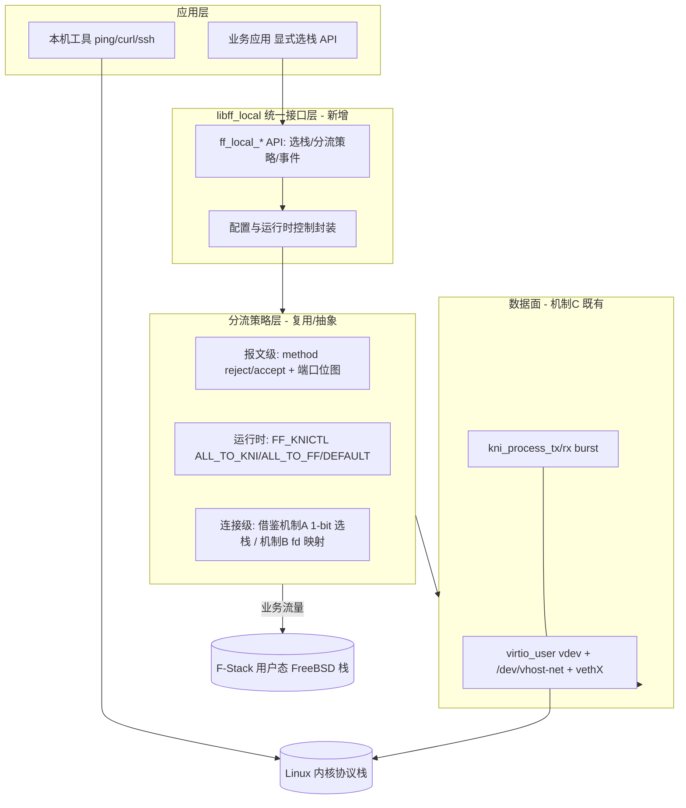

# 目标 lib 架构设计（04-architecture-design.md）

> **文档编号**：SPEC-KE-04
> **版本**：v0.1 草稿
> **日期**：2026-06-15
> **状态**：编写中
> **作用域**：本地 socket/fd/event 访问 lib 的架构与分流模型设计
> **依据**：`02-current-state-analysis.md`（代码现状）、`03-external-research.md`（外部方案），冲突以代码为准

---

## 1. 设计原则

1. **复用而非重造**：数据面直接基于 F-Stack 已落地的 **virtio-user exception path（机制 C）**，禁止回退已被 DPDK 23.11 移除的 `rte_kni`。
2. **分层解耦**：把"数据面通路（机制 C）/分流策略/编程接口"三层分离，应用只面对统一 API。
3. **默认零开销**：本能力默认关闭，开启才引入分流检查（对齐官方"KNI 默认关闭"的性能考量）。
4. **语义兼容**：与现有 `config.ini [kni]`、`FF_KNICTL` 运行时控制完全兼容，作为底座向上封装。

## 2. 总体架构（三层）

- **数据面（既有，机制 C）**：`lib/ff_dpdk_kni.c` 的 `ff_kni_init`（`:377`，virtio_user vdev `:458-466`）、`kni_process_tx/rx`（`:136-184`）、`ff_kni_process`（`:493-499`）；主循环挂载 `lib/ff_dpdk_if.c:2417-2420`。
- **分流策略层（既有，需抽象）**：报文级 `lib/ff_dpdk_if.c:1779-1801`；运行时 `handle_knictl_msg`（`:1960-1977`）；策略初始化 `init_kni`（`:545-554`，含 `kni_accept`、`get_kni_action`）。
- **接口层（新增）**：`libff_local`，把上述能力封装为统一 API（详见 `05-interface-design.md`）。

## 3. fd / socket / event 分流模型

综合三类现有机制，本特性采用**两级分流**：

### 3.1 报文级（默认通路，复用机制 C）
- 入向报文经 `ff_dpdk_if.c` 的 filter 判定（`:1581-1587` 起）+ `knictl_action`：
  - `DEFAULT`：按 `method`（reject/accept）与 `tcp_port/udp_port` 位图分流（`config.ini:250-259`）；
  - `ALL_TO_KNI` / `ALL_TO_FF`：整体切换（`:1792-1796`）。
- ICMP/ping、ARP、OSPF、未知/非业务端口 → virtio_user → 内核栈 → 本机工具可用。

### 3.2 连接级（可选增强，借鉴机制 A/B）
- **机制 A 借鉴**：为应用提供"per-连接选栈"语义——应用在 `socket()` 时通过标志（类比 `SOCK_FSTACK`，`src/event/ngx_event_connect.c:41-53`）声明该连接走内核还是 F-Stack。
- **机制 B 借鉴**：用 `fstack_kernel_fd_map`（`adapter/syscall/ff_hook_syscall.c:255-258`）式的"用户态 fd ↔ 内核 fd"映射，使一个事件循环可同时等待两栈事件并合并（`:2324-2399`）。

> 说明：连接级增强属后续里程碑可选项；报文级（机制 C）已能满足 FR-1/FR-2（ping/curl）。

## 4. 内核-用户态栈共存模型

| 维度 | F-Stack 用户态栈 | 内核栈（经 virtio-user） |
|---|---|---|
| 载体 | DPDK PMD + FreeBSD 栈 | virtio_user vdev → vethX |
| 流量 | 业务高速路径 | 本机/管理/异常路径 |
| 触发 | 默认 / `ALL_TO_FF` / 带 `SOCK_FSTACK` | `method` 命中 / `ALL_TO_KNI` / 不带 fstack 标志 |
| 编程接口 | `ff_socket/ff_kqueue/ff_kevent`（`lib/ff_api.h:81,138,139`） | 原生 `socket/epoll`（内核）+ 本特性封装 |

## 5. 选型与权衡

| 方案 | 是否采用 | 理由 |
|---|---|---|
| `rte_kni`（旧 KNI） | ✗ | DPDK 23.11 已移除（`03` 文档时间线 + 差异 D1）；本工作区为 23.11.5/24.11.6 |
| TAP/TUN（`net_tap` PMD） | △ 备选 | 实现简单但每包 syscall、性能低；仅作降级备选 |
| **virtio-user + vhost-net** | ✓ **主选** | F-Stack 已落地（机制 C），官方推荐的 KNI 替代，性能优 |
| AF_XDP/af_packet | ✗ | 与"DPDK 完全接管网卡"模型不契合 |
| 完全照搬机制 A（nginx 内嵌双栈） | ✗ | 强耦合 nginx，非通用 lib |

**结论**：以 **virtio-user 数据面（机制 C）** 为基座 + 抽象统一策略/接口层（吸收机制 A/B 的选栈与 fd 映射范式）。

## 6. 影响面（blast radius）

- 本阶段：仅新增文档，零源码改动。
- 后续实现阶段：新增 `libff_local`（独立编译单元），对 `lib/ff_dpdk_if.c`/`ff_dpdk_kni.c` 仅做**接口暴露式**改动（导出现有静态状态的 getter/setter），尽量不动报文快路径。

## 7. 待决问题（交 05/06 细化）
- 统一 API 命名与头文件归属（`lib/ff_api.h` 扩展 vs 新增 `lib/ff_local.h`）。
- 运行时控制通道：复用 `ff_msg`/`FF_KNICTL` IPC（`lib/ff_msg.h:47,112-127`）还是新增。
- 连接级选栈是否纳入首个里程碑。
