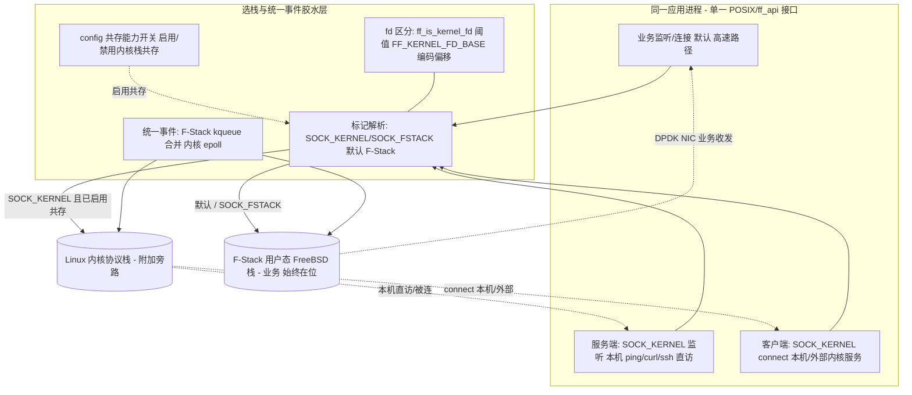

# 04 架构设计：F-Stack + 内核栈「共存」+ per-fd 标记选栈 + 统一事件

> **文档编号**：SPEC-KE-04
> **版本**：v5（编译宏门控范式）
> **日期**：2026-06-17
> **状态**：编写中
> **作用域**：双层开关（编译宏 + config）、共存架构、选栈模型、双栈统一事件、客户端/服务端双向数据流、hook 与原生双模式。
> **依据**：`02`（代码现状）、`03`（外部方案），冲突以代码为准。

---

## 1. 设计原则

1. **F-Stack 始终在位（铁律 NFR-3）**：应用整体 on F-Stack（`ff_init`/`ff_run` 或 LD_PRELOAD + fstack 实例），业务高速路径**永远**走 F-Stack 用户态栈；内核栈只是 per-fd **附加**的旁路通道，**绝不替代/旁路 F-Stack**。
2. **双层开关（v5 核心）**：编译宏 `FF_KERNEL_COEXIST` gate **编译期**（默认关闭，关则共存代码不编译）；config `[stack] kernel_coexist` gate **运行期**（仅编译宏已开启时生效）。
3. **复用而非重造**：hook 模式 `FF_KERNEL_EVENT`（`02 §2`）已实现共存，固化为主基线；nginx `kernel_network_stack`（`02 §3`）为同构参考；原生共存已落地（`02 §4`），v5 仅加编译宏门控。
4. **per-fd 标记选栈**：`socket()`/`ff_socket()` 的 `type` 带 `SOCK_KERNEL` → 内核栈；默认/`SOCK_FSTACK` → F-Stack。`SOCK_FSTACK` 优先（同置走 F-Stack，`ff_hook_socket:387` / `ff_syscall_wrapper.c:926`）。
5. **fd 区分 + 统一事件**：受管内核 fd = 宿主 fd + `FF_KERNEL_FD_BASE`(0x40000000) 编码偏移，`ff_is_kernel_fd` 阈值判定；后续 syscall/事件按 fd 自动路由；`ff_epoll_pairs` 配对表合并 F-Stack kqueue 事件 + 内核 epoll 事件。
6. **默认零开销/零回归（编译期保证）**：宏未定义时共存代码不参与编译，`libfstack.a` 与原 F-Stack 逐字节一致；即使宏开启，未启用共存或默认/`SOCK_FSTACK` 路径亦逐字节一致（NFR-1）。
7. **与 KNI 无关**：不涉及报文回灌。

---

## 1bis. 双层开关与零回归路径（v5 核心）

```
编译期 gate（FF_KERNEL_COEXIST，lib/Makefile 默认注释关）
  ├─ 未定义（默认）──► 共存代码全部 #ifdef 排除，不编译
  │                    SOCK_FSTACK/SOCK_KERNEL 宏不可见（APP 亦不可见，opt-in）
  │                    ff_socket 无内核分支 / ff_epoll 无合并 / 各 ff_* 无路由
  │                    ► libfstack.a 与原 F-Stack 逐字节零回归（nm/objdump 无 ff_host_*/ff_epoll_pairs）
  │
  └─ 已定义（make FF_KERNEL_COEXIST=1 或取消注释）──► 编译进共存能力
        │
        └─ 运行期 gate（config [stack] kernel_coexist）
              ├─ =0（默认）──► ff_socket(SOCK_KERNEL) 退化为 F-Stack（ff_syscall_wrapper.c:926 条件含 && kernel_coexist）
              └─ =1 ─────────► per-fd SOCK_KERNEL 走内核栈，统一事件合并
```

- **opt-in 语义**：`SOCK_FSTACK`/`SOCK_KERNEL` 宏被 `FF_KERNEL_COEXIST` 包裹（`ff_api.h:81-99`），消费方 APP 须同样定义 `FF_KERNEL_COEXIST` 才能见到这两个标记宏并使用共存——这是「默认关闭、显式开启」的合理代价。
- **两层缺一不可**：编译宏开但 config 关 → 共存代码在但运行期不启用；编译宏关 → 无论 config 如何，共存代码不存在。

---

## 2. 总体架构（同一进程内双栈共存）



- **业务路径（A1→F）始终是 F-Stack**；内核路径（A2/A3→K）是 per-fd 附加旁路。
- hook 模式：MK=`ff_hook_socket:387-390`，OWN=`is_fstack_fd:309`/`CHECK_FD_OWNERSHIP:57-61`，EV=`fstack_kernel_fd_map:257-258`+合并 `:2324+`。
- 原生模式：MK=`ff_socket:926-931`，OWN=`ff_is_kernel_fd`（`FF_KERNEL_FD_BASE` 偏移），EV=`ff_epoll_pairs`+合并（`ff_epoll.c:210-241`），**已实现**，v5 加 `FF_KERNEL_COEXIST` 门控，见 §5。

---

## 3. 选栈模型

### 3.1 选栈决策
```
若 编译宏 FF_KERNEL_COEXIST 未定义 -> 全部 F-Stack（共存代码不编译，等价原 F-Stack，NFR-1）
否则若 config kernel_coexist==0    -> 全部 F-Stack（SOCK_KERNEL 退化，NFR-1）
否则 per-fd:
   type 带 SOCK_KERNEL 且 !SOCK_FSTACK -> 内核栈（受管内核 fd = host_fd + FF_KERNEL_FD_BASE）
   否则（默认 / SOCK_FSTACK）          -> F-Stack 用户态栈
```
- **无「整进程默认内核」**：两层开关只决定「能否使用内核旁路」，默认始终 per-fd F-Stack。

### 3.2 选栈实现范式（hook：复用代码）
```c
/* ff_hook_socket（已实现，固化复用） */
if (fstack_territory(domain,type,proto)==0) return ff_linux_socket(...);   /* 非领域 → 内核 */
if ((type & SOCK_KERNEL) && !(type & SOCK_FSTACK)) {                       /* 内核栈 */
    type &= ~SOCK_KERNEL; return ff_linux_socket(...);
}
type &= ~SOCK_FSTACK; /* → F-Stack 业务栈 */
```

### 3.3 同构参考（nginx）
进程 on F-Stack；per-server `kernel_network_stack` → `belong_to_host`；双事件后端（kqueue 主 + Linux epoll `ngx_ff_host_event_actions`）在同一 worker 共存（`02 §3`）——证明「同进程双栈 + 双事件后端」范式成熟可行。

---

## 4. 双向数据流（共存）

### 4.1 服务端方向
1. 业务监听：`socket()`（默认/`SOCK_FSTACK`）→ F-Stack fd → `bind/listen` 落 F-Stack → 经 DPDK NIC 服务业务。
2. 内核监听（共存）：`socket(...|SOCK_KERNEL)` → 受管内核 fd → `bind/listen` 落内核栈 → 本机 `ping`/`curl <内核IP:port>` 直达，`accept` 返回内核 fd。
3. **两类监听同进程并存**，各自事件在同一 epoll 循环投递。

### 4.2 客户端方向
1. 业务客户端：默认/`SOCK_FSTACK` → F-Stack fd → `connect` 走 F-Stack（DPDK NIC）。
2. 内核客户端（共存）：`socket(...|SOCK_KERNEL)` → 受管内核 fd → `connect`（`ff_hook_connect:858` 按归属）走 `ff_linux_connect:144` → 可达 127.0.0.1/本机 IP/外部内核服务。
3. 后续 `send/recv/close` 按归属自动分流。

> 关键：客户端与服务端共用「创建时标记定栈、后续按归属路由」机制；业务始终 F-Stack，内核为附加旁路。

---

## 5. 双栈统一事件模型

### 5.1 hook 模式（复用）
- 对外 epoll；F-Stack 侧 kqueue，内核侧 epoll；`fstack_kernel_fd_map:257-258` 建 F-Stack epoll fd↔内核 epoll fd 映射。
- 一次 `wait`：先 `timeout=0`+节流取内核事件（`:2324+`/`:2333-2336`），再合并 F-Stack 事件（`maxevents>=2` `:2212-2218`）。
- `close` 联动释放两栈 fd（`:1874-1883`）。

### 5.2 原生模式（已实现，实测；v5 加编译宏门控）
- **fd 区分**：受管内核 fd = 宿主 fd + `FF_KERNEL_FD_BASE`(0x40000000) 编码偏移（`ff_host_interface.h:112-127`），`ff_is_kernel_fd` 阈值判定——**非** 独立归属表/enum（D6）。
- `ff_socket(SOCK_KERNEL)`（编译宏开 + config 开）经 `ff_host_socket` 建**受管内核 fd**（`ff_kernel_fd_encode`，不暴露裸绕过）。
- `ff_epoll_create` 仍返回 kqueue fd（`ff_epoll.c:71-75`，不变）；首次为某 kqueue 加内核 fd 时，惰性建宿主 `epoll_create1` 并在 `ff_epoll_pairs[64]` 配对（`:42-68`）。
- `ff_epoll_ctl`（`:97-111`）：内核 fd → 配对宿主 `ff_host_epoll_ctl`；F-Stack fd → 原 `ff_kevent`（不变）。
- `ff_epoll_wait`（`:210-241`）：先 `ff_host_epoll_wait(timeout=0)` 取内核事件，再 `ff_kevent_do_each` 取 F-Stack 事件，合并返回；无内核 fd 时退化原 kqueue-only。
- `ff_close`（`:1092-1093`）按 fd 路由到 `ff_host_close`；**注**：close 时对 `ff_epoll_pairs` 配对的清理需 review 复核（见 `03 §2.6` 上游 fd leak fix 提示）。
- 默认/`SOCK_FSTACK` 路径完全走原 `ff_socket`/`ff_epoll.c`，逐字节零回归；编译宏关时该分支全部 `#ifdef` 排除。
- **路由覆盖限制（D8）**：仅 13 个入口加了路由（见 `02 §4.3`）；`ff_readv/ff_writev/ff_send/ff_recv/ff_getpeername/ff_getsockname/ff_shutdown/ff_ioctl/ff_sendmsg/ff_recvmsg` 未覆盖，受管内核 fd 调用这些接口会误走 F-Stack（已知限制）。

---

## 6. 内核-用户态栈共存矩阵

| 维度 | F-Stack 用户态栈（业务，默认） | 内核栈（附加旁路） |
|---|---|---|
| 载体 | DPDK PMD + FreeBSD 栈 | Linux 内核协议栈 |
| 流量 | 业务高速路径 | 本机/管理/客户端连本机或外部内核服务 |
| 选栈触发 | 默认 / `SOCK_FSTACK` | `SOCK_KERNEL`（需启用共存） |
| 事件 | `ff_kqueue`/`ff_kevent` | `epoll`（宿主） |
| 是否可被旁路 | **否（始终在位）** | 仅附加，可禁用 |

---

## 7. 选型与权衡

| 方案 | 是否采用 | 理由 |
|---|---|---|
| **hook FF_KERNEL_EVENT 共存固化** | ✓ **主基线** | 已实现共存（`02 §2`），应用 on F-Stack + per-fd 内核旁路 |
| **原生 ff_api 统一事件共存** | ✓ **已实现** | 已落地（`02 §4`），v5 加 `FF_KERNEL_COEXIST` 编译宏门控（默认关） |
| **编译宏 `FF_KERNEL_COEXIST` 门控** | ✓ **v5 核心** | 默认关闭 → 共存代码不编译、逐字节零回归；显式开启 opt-in |
| **nginx kernel_network_stack** | ✓ 参考 | 同构双事件后端，证明可行 |
| v3 `ff_host_socket` 纯内核旁路 | ✗ **已废弃** | 绕开 F-Stack，违背共存铁律（NFR-3） |
| 整进程 `default_stack=kernel` | ✗ **已废弃** | 反 F-Stack |
| `ff_local_*` 双 API / 线程级选栈 / KNI 回灌 | ✗ | 不符诉求/非本问题域 |

**结论**：以 **hook FF_KERNEL_EVENT 共存为主基线 + 原生统一事件共存（已实现）** 为骨架，外层 `FF_KERNEL_COEXIST` 编译宏门控（默认关）+ per-fd 标记 + 运行期 config 开关，覆盖服务端/客户端双向、hook/原生双模式，F-Stack 始终在位。

---

## 8. 影响面（blast radius）
- 本阶段（v5 spec）：仅文档。
- 编译宏门控阶段：对 `02 §4bis.2` 的 7 文件已落地共存代码加 `#ifdef FF_KERNEL_COEXIST` 包裹 + `lib/Makefile` 宏块（默认注释关，已就位 `:174-177`）；宏关闭时共存代码不编译、逐字节零回归，避免触碰报文快路径热点。
- 已实现部分：(a) hook 模式复用固化；(b) 原生共存（受管内核 fd 编码偏移 + `ff_host_*` 桥 + `ff_epoll_pairs` 合并，分布于 `ff_epoll.c`/`ff_syscall_wrapper.c`/`ff_host_interface.{c,h}`）；(c) `ff_config.{c,h}` 运行期 `kernel_coexist` 开关。

---

## 9. 待决问题（交 05/06/09 细化）
- 编译宏包裹的边界精确性：确保 `#ifdef` 不破坏非共存代码（如 `ff_host_interface.c` 已有非共存函数与新增 18 桥的分隔）。
- `ff_close` 对 `ff_epoll_pairs` 配对的清理是否完整（fd leak 复核，`03 §2.6`）。
- D8 路由覆盖范围是否需补齐（`ff_readv/ff_writev/ff_send/ff_recv` 等），或作为已知限制接受。
- 可观测统计（`05 §6` `ff_stack_get_stats`）当前**未实现**，是否纳入本轮（D5）。
