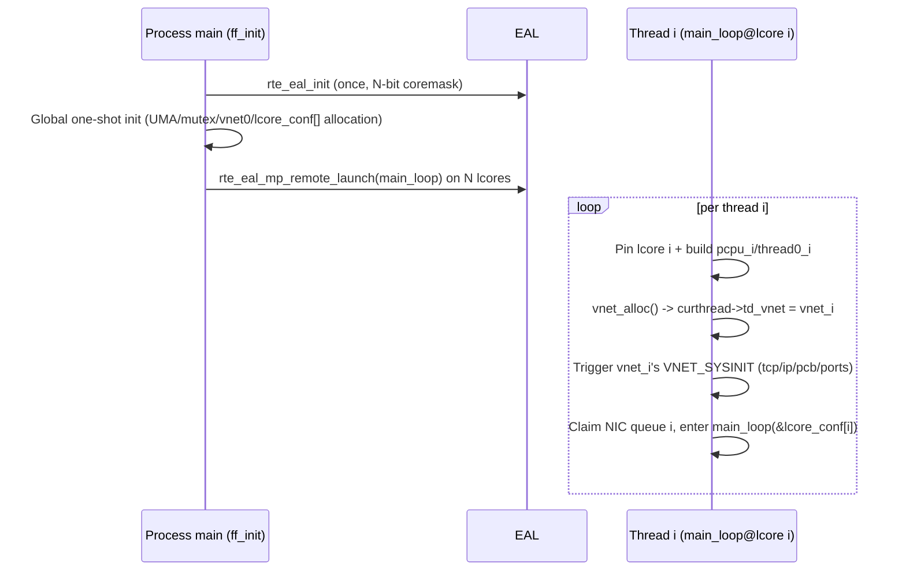

# 04 Stack-Instance Initialization Mechanism Design

> Core difficulty: how to let N threads in one process each initialize an independent protocol-stack instance. Source: `_material_A_globalstate.md §2`, `_material_D_cross.md §1`.

## 1. Hard Conclusion: The Existing Initialization Sequence Cannot Run N Times

### 1.1 Current Sequence (`ff_freebsd_init.c:124-192`, process-level one-shot)
1. `kern_setenv` (`:134-148`) — global env vars, N runs overwrite each other.
2. `pcpup = malloc(...)` + `pcpu_init` + `PCPU_SET(prvspace, pcpup)` (`:152-155`) — writes the global singleton `pcpup`.
3. `ff_init_thread0()` (`:157` → `ff_compat.c:157-160`) — points the TLS `pcurthread` at the global singleton `thread0`.
4. `uma_startup1/2` + `uma_page_slab_hash` (`:162-167`) — UMA allocator global init, inherently one-shot.
5. `mutex_init()` + **`mi_startup()`** (`:169-170`) — see §1.2.
6. `sx_init(&proctree_lock)` (`:171`) — global lock, repeated init on N runs.
7. `lo_set_defaultaddr()` (`:187`) — loopback configured with 127.0.0.1, operates on `V_ifnet`.

### 1.2 `mi_startup()`/SYSINIT Statically Determined Not Runnable N Times 【Hard Conclusion】
- `mi_startup()` (`ff_init_main.c:173-285`) walks the `sysinit_set` linker set, executes each SYSINIT, then ticks `(*sipp)->subsystem = SI_SUB_LAST` (`:271`).
- On a second call, `if (sysinit == NULL)` (`:188`) no longer holds; all entries in the sort loop already have subsystem `SI_SUB_LAST`, and `:235-236` all `continue` — **the second `mi_startup()` does nothing**.
- The SYSINIT table is a **process-level linker set, one table shared by all threads** (`ff_init_main.c:122` `SET_DECLARE(sysinit_set,...)`).
- Among them, `SYSINIT(p0init,...)` (`ff_init_main.c:523`) initializes the global singletons proc0/thread0; `SYSINIT(callwheel_init,...)` (`ff_kern_timeout.c:279`) initializes the global singleton `cc_cpu`.

> **【Hard conclusion · statically determinable】**: the existing `ff_freebsd_init()` + `mi_startup()` + SYSINIT mechanism **cannot produce N independent stack instances by "calling once per thread"** — the first call does all real initialization and ticks; subsequent calls no-op, and subsequent threads only get the first thread's global stack state. The initialization architecture must be restructured.

## 2. Two Restructuring Routes

### Route B (preferred): Enable VIMAGE + one vnet per thread

**Basis (`_material_D_cross.md §1`, source-verified):**
- VNET is FreeBSD's native "multi-stack-instance" subsystem: `struct vnet` (`vnet.h:69`) is one complete stack instance, allocated by `vnet_alloc()` (`vnet.c:239`), selected per-thread by `curvnet=curthread->td_vnet` (`vnet.h:176`).
- Under VIMAGE, `VNET_DEFINE` globals are virtualized by the vnet data segment (`vnet.h:279-306`); `VNET_SYSINIT` runs once per vnet (`vnet.h:442-444` comment: under VIMAGE `VNET_SYSINIT` maps to per-vnet sysinit).

**Initialization flow (design):**
1. Process startup: EAL init (once) + global one-shot init (UMA, mutex, `mi_startup`'s **non-vnet part** runs once to build vnet0).
2. At each thread startup: `vnet_alloc()`s one vnet → sets `curthread->td_vnet` → triggers that vnet's `VNET_SYSINIT` (domaininit/tcp_init/ip_init/PCB hash/port allocation each built once per vnet).
3. All subsequent `V_xxx` accesses by that thread land on its own instance via `curvnet`.

**Advantages**: reuses the kernel's mature multi-network-stack infrastructure, **no need to manually per-thread-ize hundreds of `VNET_DEFINE` globals**; naturally matches f-stack's already-TLS `pcurthread`.

**Honest boundary (requires runtime validation)**: f-stack's `opt_global.h` currently has no VIMAGE (`_material_A §0.2`), and FreeBSD is heavily emasculated (`ff_init_main.c` has large `#if 0` blocks). VIMAGE depends on the `SI_SUB_VNET` SYSINIT family, `vnet_data_mem` segment relocation, eventhandler/sysctl vnet-ization — **whether it runs to completion in f-stack's userspace emasculated environment requires runtime validation; feasibility must not be asserted**.

### Route A (alternative/supplement): manual per-thread-ization + restructure mi_startup
- Per-thread-ize all network-stack globals one by one (including the hundreds of degraded `VNET_DEFINE`s), and change `mi_startup` to "run independently once per thread, with a per-thread sysinit-completion bitmap".
- Very large engineering effort (hundreds of globals), but does not depend on VIMAGE infrastructure availability.
- **Actual relationship**: Route A and Route B are **not strictly an either/or** — even with Route B, the non-VNET f-stack self-made globals (`pcpup`/`thread0`/`proc0`/`lcore_conf`/`cc_cpu`/`msg_iov_tmp`, see `03`) **are not covered by VIMAGE** and still require manual per-thread-ization per Route A. Therefore the recommended combination: **VNET covers network-stack globals (Route B) + manual per-thread-ization of f-stack self-made globals (subset of Route A)**.

## 3. `ff_init`/`ff_run` Restructure Shape

- `rte_eal_init` (`ff_dpdk_if.c:1594`) **can only be called once per process** (`_material_C §2.4`), so `ff_init` cannot be re-run wholesale per thread.
- **Recommended shape**:
  - `ff_init` called once: completes EAL + global one-shot init + allocation of N per-lcore instance states (`lcore_conf[]` etc.).
  - Each thread entry (launched by `rte_eal_mp_remote_launch` running `main_loop` on each lcore, `ff_dpdk_if.c:2770`): pin lcore → build independent thread/pcpu context → `vnet_alloc()`+set `td_vnet` → run that thread's per-thread stack init → enter `main_loop` using `&lcore_conf[rte_lcore_id()]`.
- `ff_init`/`ff_run` API signatures unchanged (`ff_init.c:36,59`), backward compatible (`01` A4).

## 4. Initialization Sequence (Target Shape)

## 5. Honest-Boundary Summary (Requires Runtime Validation)
1. Whether VIMAGE runs to completion in f-stack's emasculated userspace (`vnet_alloc`/`VNET_SYSINIT`/segment-relocation dependencies).
2. How to split `mi_startup`'s non-vnet part from per-thread vnet part; UMA N-thread concurrent MT-safety.
3. After building `pcpu_i`/`thread0_i` per thread, whether all PCPU macro internals correctly route to this thread's instance.
4. Interaction with tcp_hpts after callout becomes per-instance callwheel (`ff_kern_timeout.c:1252-1274`).
