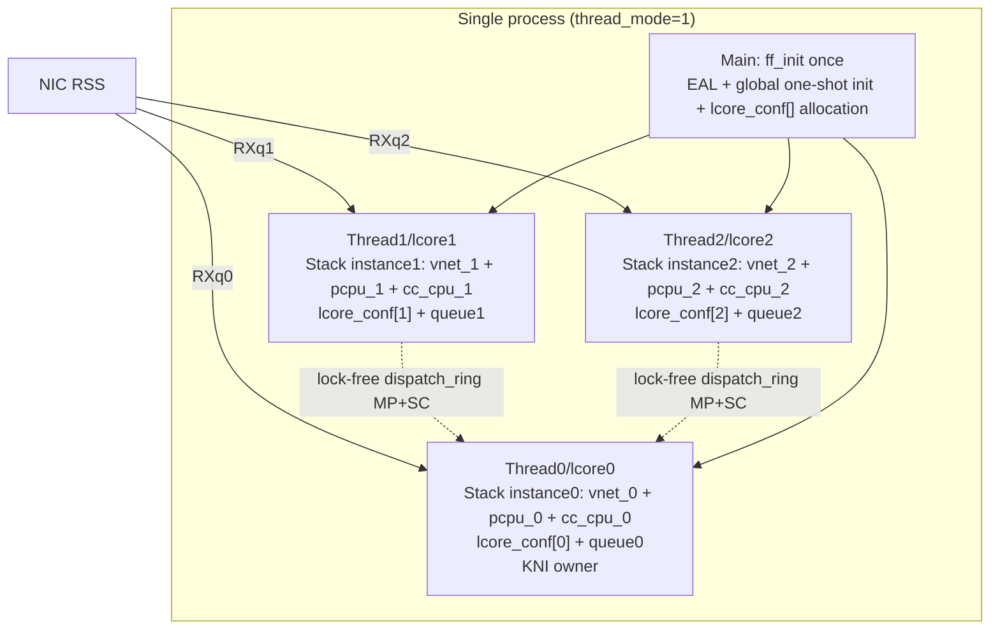

# 05 Solution and Architecture Design

> The only design direction of this round: in-library native single-process multi-thread multi-stack-instance (share-nothing). No adapter recommendation.

## 1. Overall Architecture

### 1.1 Target Shape
One process: DPDK EAL launches N lcore threads (each pinned to one core), each thread holds an **independent stack instance**:
- **Network-stack globals** (ifnet/PCB/routing/ports/counters) isolated per-thread via **VNET** (`curvnet=curthread->td_vnet`);
- **f-stack self-made globals** (`lcore_conf`/`pcpup`/`cc_cpu`/`thread0`/`msg_iov_tmp`) isolated via `rte_lcore_id()`-indexed arrays or `__thread`;
- The data plane relies on NIC RSS to hash different flows to different RX queues (each thread exclusively owns one queue); cross-thread dispatch uses the lock-free `dispatch_ring` (MP+SC).

### 1.2 Overall per-thread-ization Strategy

| Global category | Isolation method | Reason |
|---|---|---|
| Network-stack `VNET_DEFINE` globals (hundreds) | **VNET/VIMAGE** (`curvnet=td_vnet`) | Native subsystem, one enable covers all; `vnet.h:176/279-306` |
| Accessed by other threads by id (`lcore_conf`/`veth_ctx`) | **Array + `rte_lcore_id()` index** | Cross-thread access by subscript (dispatch/stats); `ff_dpdk_if.c:123,179` |
| Pure thread-private (`msg_iov_tmp`/`seed`/`stop_loop`) | **`__thread`** | No cross-thread access; TLS fastest, no false sharing |
| pcpu/thread/callout (`pcpup`/`thread0`/`cc_cpu`) | One per instance (`RTE_PER_LCORE` or array) | Kernel identity/timer foundation, one per stack; `ff_freebsd_init.c:69`, `ff_kern_timeout.c:180` |

## 2. Data Plane and Control Plane

- **Data-plane ring** (`dispatch_ring`, `ff_dpdk_if.c:129`): keep `RING_F_SC_DEQ` (MP+SC, `:619`) — multi-source lcores write, single owner reads is an intrinsic requirement; `rte_ring`'s lock-free semantics apply as-is under multi-thread, **smooth migration, flags unchanged** (`_material_B §2.3`).
- **Control-plane ring** (`msg_ring[RTE_MAX_LCORE]`, `:177`): already array-ized, keep SP+SC, each thread uses its own proc_id/lcore index (`_material_B §2.4`).
- **mempool**: `pktmbuf_pool[NB_SOCKETS]` (`:125`) shared per NUMA socket; DPDK per-lcore cache is MT-safe out of the box (`rte_mempool.h:28-32`), no change needed (`_material_B §3`).

## 3. Relationship with Existing Modes

- **Multi-process zero regression**: thread_mode opt-in, off by default; when off, all paths take the existing primary/secondary branches, byte-identical (`07`). The two modes are mutually exclusive.
- **Unified instance index key**: both DPDK-side `rte_lcore_id()` (TLS, `rte_lcore.h:80`) and FreeBSD-side `curthread->td_vnet` (`vnet.h:176`) are per-thread; unify "current thread" as the instance key.

## 4. Rejected Alternatives Comparison (Recorded Only, Not Recommended)

| Alternative | Description | Rejection reason |
|---|---|---|
| **Shared single stack + fine-grained locking** | One global stack, N threads lock to access PCB/routing/ifnet | Violates f-stack's share-nothing lock-free philosophy; breaks dispatch_ring's single-consumer assumption; lock contention degrades p99; diverges from the multi-process performance model. **Not recommended.** |
| **LD_PRELOAD adapter multi-worker** | Application-side socket hijacking, multi-worker maps to underlying multi-process | Application-side access mechanism, **not a stack-side native multi-threaded run model**, does not satisfy this round's goal. Current-state record only (`02 §4`). |

## 5. Overall Solution Feasibility

- **DPDK side**: basically ready; changes concentrate on per-lcore-izing `lcore_conf` (`_material_B §6`).
- **Network-stack globals**: VNET provides the native solution (preferred), but VIMAGE availability in f-stack userspace **requires runtime validation**.
- **Init + f-stack self-made globals**: `mi_startup`/`ff_init` must be restructured and a few foundation globals manually per-thread-ized (`04`/`03`).
- **Overall**: **feasible but large engineering effort, with key runtime uncertainties**. Recommended to start from low-hanging fruit (`msg_iov_tmp`) and VIMAGE feasibility validation (PoC) per the `10` milestones, advancing with increasing risk.
