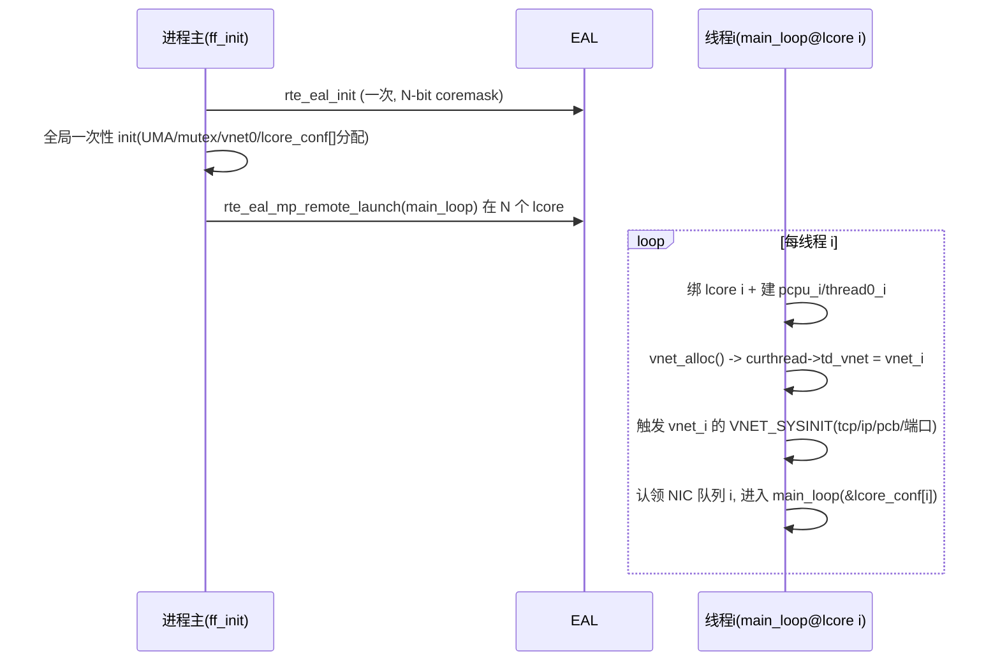

# 04 栈实例初始化机制设计

> 核心难点：如何让一个进程内 N 个线程各自初始化出一份独立协议栈实例。来源 `_material_A_globalstate.md §2`、`_material_D_cross.md §1`。

## 1. 硬结论：现有初始化序列不可 N 次执行

### 1.1 现状序列（`ff_freebsd_init.c:124-192`，进程级一次性）
1. `kern_setenv`（`:134-148`）— 全局环境变量，N 次互相覆盖。
2. `pcpup = malloc(...)` + `pcpu_init` + `PCPU_SET(prvspace, pcpup)`（`:152-155`）— 写全局单例 `pcpup`。
3. `ff_init_thread0()`（`:157` → `ff_compat.c:157-160`）— 把 TLS `pcurthread` 指向全局单例 `thread0`。
4. `uma_startup1/2` + `uma_page_slab_hash`（`:162-167`）— UMA 分配器全局初始化，天生一次性。
5. `mutex_init()` + **`mi_startup()`**（`:169-170`）— 见 §1.2。
6. `sx_init(&proctree_lock)`（`:171`）— 全局锁，N 次重复 init。
7. `lo_set_defaultaddr()`（`:187`）— loopback 配 127.0.0.1，操作 `V_ifnet`。

### 1.2 `mi_startup()`/SYSINIT 静态判定不可 N 次执行【硬结论】
- `mi_startup()`（`ff_init_main.c:173-285`）遍历 `sysinit_set` linker set，逐个执行 SYSINIT 后把 `(*sipp)->subsystem = SI_SUB_LAST` 打勾（`:271`）。
- 二次调用时 `if (sysinit == NULL)`（`:188`）已不成立，排序循环里所有条目 subsystem 已是 `SI_SUB_LAST`，`:235-236` 全部 `continue` 跳过 → **第二次 `mi_startup()` 什么都不做**。
- SYSINIT 表是**进程级 linker set，全线程共享一张**（`ff_init_main.c:122` `SET_DECLARE(sysinit_set,...)`）。
- 其中 `SYSINIT(p0init,...)`（`ff_init_main.c:523`）初始化全局单例 proc0/thread0；`SYSINIT(callwheel_init,...)`（`ff_kern_timeout.c:279`）初始化全局单例 `cc_cpu`。

> **【硬结论·静态可判定】**：现有 `ff_freebsd_init()` + `mi_startup()` + SYSINIT 机制**无法通过「每线程各调一次」得到 N 份独立协议栈实例**——第一次调用做全部真初始化并打勾，后续调用空转，后续线程只会拿到第一次那份全局栈状态。必须重构初始化架构。

## 2. 两条重构路线

### 路线乙（首选）：启用 VIMAGE + 每线程一份 vnet

**依据（`_material_D_cross.md §1`，源码坐实）：**
- VNET 是 FreeBSD 原生「多协议栈实例」子系统：`struct vnet`（`vnet.h:69`）是一份完整栈实例，`vnet_alloc()`（`vnet.c:239`）分配，`curvnet=curthread->td_vnet`（`vnet.h:176`）per-thread 选择。
- VIMAGE 下 `VNET_DEFINE` 全局按 vnet 数据段虚拟化（`vnet.h:279-306`），`VNET_SYSINIT` 每个 vnet 各跑一次（`vnet.h:442-444` 注释：VIMAGE 下 `VNET_SYSINIT` 映射为按 vnet 的 sysinit）。

**初始化流程（设计）：**
1. 进程启动：EAL init（一次）+ 全局一次性 init（UMA、mutex、`mi_startup` 的**非-vnet 部分**跑一次建立 vnet0）。
2. 每线程启动时：`vnet_alloc()` 一份 vnet → 设 `curthread->td_vnet` → 触发该 vnet 的 `VNET_SYSINIT`（domaininit/tcp_init/ip_init/PCB hash/端口分配等按 vnet 各建一份）。
3. 该线程后续所有 `V_xxx` 访问经 `curvnet` 落到自己那份。

**优点**：复用内核成熟的多网络栈基建，**不必手工 per-thread 化数百个 `VNET_DEFINE` 全局**；与 f-stack 已 TLS 的 `pcurthread` 天然契合。

**诚实边界（须运行时验证）**：f-stack `opt_global.h` 当前无 VIMAGE（`_material_A §0.2`），且大量阉割 FreeBSD（`ff_init_main.c` 大段 `#if 0`）。VIMAGE 依赖 `SI_SUB_VNET` 系列 SYSINIT、`vnet_data_mem` 段重定位、eventhandler/sysctl 的 vnet 化——**在 f-stack 用户态裁剪环境能否完整跑通须运行时验证**，不得臆断可行。

### 路线甲（备选/补充）：手工 per-thread 化 + 重构 mi_startup
- 把所有网络栈全局（含 `VNET_DEFINE` 退化的数百个）逐个 per-thread 化，并把 `mi_startup` 改为「每线程独立跑一遍、每线程一份 sysinit 完成标记位图」。
- 工程量极大（数百个全局），但不依赖 VIMAGE 基建可用性。
- **实际关系**：路线甲与路线乙**并非纯二选一**——即使走路线乙，非-VNET 的 f-stack 自造全局（`pcpup`/`thread0`/`proc0`/`lcore_conf`/`cc_cpu`/`msg_iov_tmp`，见 `03`）**VIMAGE 不覆盖，仍须按路线甲手工 per-thread 化**。故推荐组合：**VNET 覆盖网络栈全局（路线乙）+ 手工 per-thread 化 f-stack 自造全局（路线甲子集）**。

## 3. `ff_init`/`ff_run` 重构形态

- `rte_eal_init`（`ff_dpdk_if.c:1594`）**全进程只能调用一次**（`_material_C §2.4`），故不能每线程整份重跑 `ff_init`。
- **推荐形态**：
  - `ff_init` 只调一次：完成 EAL + 全局一次性 init + N 份 per-lcore 实例状态（`lcore_conf[]` 等）的分配。
  - 每线程入口（由 `rte_eal_mp_remote_launch` 在各 lcore 拉起 `main_loop`，`ff_dpdk_if.c:2770`）里：绑 lcore → 建独立 thread/pcpu 上下文 → `vnet_alloc()`+设 `td_vnet` → 跑该线程的 per-thread 栈初始化 → 进入 `main_loop` 用 `&lcore_conf[rte_lcore_id()]`。
- `ff_init`/`ff_run` API 签名不变（`ff_init.c:36,59`），向后兼容（`01` A4）。

## 4. 初始化时序（目标形态）

## 5. 诚实边界汇总（须运行时验证）
1. VIMAGE 在 f-stack 阉割用户态能否完整跑通（`vnet_alloc`/`VNET_SYSINIT`/段重定位依赖）。
2. `mi_startup` 非-vnet 部分与 per-thread vnet 部分如何切分、UMA N 线程并发 MT-safe。
3. per-thread 建 `pcpu_i`/`thread0_i` 后 PCPU 宏底层是否全部正确路由到本线程实例。
4. callout 改每实例 callwheel 后与 tcp_hpts 交互（`ff_kern_timeout.c:1252-1274`）。
