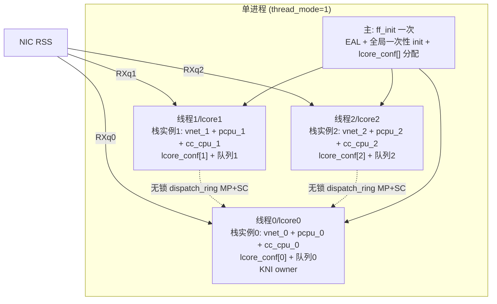

# 05 方案与架构设计

> 本轮唯一设计方向：库内原生单进程多线程多协议栈实例（share-nothing）。不推荐 adapter。

## 1. 整体架构

### 1.1 目标形态
一个进程内由 DPDK EAL 拉起 N 个 lcore 线程（每线程绑一核），每线程持有一份**独立协议栈实例**：
- **网络栈全局**（ifnet/PCB/路由/端口/计数器）经 **VNET**（`curvnet=curthread->td_vnet`）按线程隔离；
- **f-stack 自造全局**（`lcore_conf`/`pcpup`/`cc_cpu`/`thread0`/`msg_iov_tmp`）经数组按 `rte_lcore_id()` 索引或 `__thread` 隔离；
- 数据面靠 NIC RSS 把不同流散列到不同 RX 队列（每线程独占一队列）；跨线程分发用无锁 `dispatch_ring`（MP+SC）。

### 1.2 per-thread 化总策略

| 全局类别 | 隔离手段 | 理由 |
|---|---|---|
| 网络栈 `VNET_DEFINE` 全局（数百个） | **VNET/VIMAGE**（`curvnet=td_vnet`） | 原生子系统，一次启用覆盖全部；`vnet.h:176/279-306` |
| 需被其他线程按 id 访问（`lcore_conf`/`veth_ctx`） | **数组 + `rte_lcore_id()` 索引** | 跨线程可按下标访问（分发/统计）；`ff_dpdk_if.c:123,179` |
| 纯线程私有（`msg_iov_tmp`/`seed`/`stop_loop`） | **`__thread`** | 无跨线程访问，TLS 最快无伪共享 |
| pcpu/thread/callout（`pcpup`/`thread0`/`cc_cpu`） | 每实例一份（`RTE_PER_LCORE` 或数组） | 内核身份/定时器底座，每栈一份；`ff_freebsd_init.c:69`、`ff_kern_timeout.c:180` |

## 2. 数据面与控制面

- **数据面 ring**（`dispatch_ring`，`ff_dpdk_if.c:129`）：保持 `RING_F_SC_DEQ`（MP+SC，`:619`）——多源 lcore 写、单 owner 读是本质需求，多线程下 `rte_ring` 无锁语义原样适用，**平滑迁移，flag 不变**（`_material_B §2.3`）。
- **控制面 ring**（`msg_ring[RTE_MAX_LCORE]`，`:177`）：已数组化，保持 SP+SC，每线程用自己 proc_id/lcore 索引（`_material_B §2.4`）。
- **mempool**：`pktmbuf_pool[NB_SOCKETS]`（`:125`）按 NUMA socket 共享，DPDK per-lcore cache 开箱 MT-safe（`rte_mempool.h:28-32`），无需改造（`_material_B §三`）。

## 3. 与既有模式的关系

- **多进程模式零回归**：thread_mode opt-in 默认关；关时所有路径走既有 primary/secondary 分支，字节级不变（`07`）。两模式互斥。
- **实例索引键统一**：DPDK 侧 `rte_lcore_id()`（TLS，`rte_lcore.h:80`）与 FreeBSD 侧 `curthread->td_vnet`（`vnet.h:176`）都是 per-thread，统一以「当前线程」为实例键。

## 4. 被否决备选对比（仅记录，不推荐）

| 备选 | 描述 | 否决理由 |
|---|---|---|
| **共享单栈 + 细粒度锁** | 一份全局栈，N 线程加锁访问 PCB/路由/ifnet | 违背 f-stack share-nothing 无锁理念；破坏 dispatch_ring 单消费者假设；锁竞争劣化 p99；与多进程性能模型背离。**不推荐。** |
| **LD_PRELOAD adapter 多 worker** | 应用侧劫持 socket，多 worker 映射底层多进程 | 属应用侧接入机制，**不是栈侧原生多线程运行模型**，不满足本轮目标。仅作现状记录（`02 §4`）。 |

## 5. 方案可行性总评

- **DPDK 侧**：基本就绪，改动集中在 `lcore_conf` per-lcore 化（`_material_B §六`）。
- **网络栈全局**：VNET 提供原生解法（首选），但 VIMAGE 在 f-stack 用户态可用性**须运行时验证**。
- **初始化 + f-stack 自造全局**：需重构 `mi_startup`/`ff_init` 并手工 per-thread 化少数底座全局（`04`/`03`）。
- **总体**：**可行但工程量大、含关键运行时不确定项**。建议按 `10` 里程碑从低垂果实（`msg_iov_tmp`）与 VIMAGE 可行性验证（PoC）起步，危险度递增推进。
