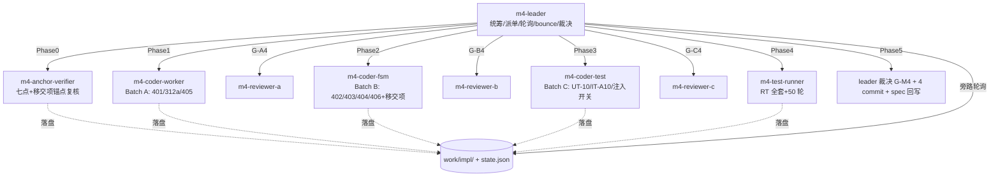

# M4 实现计划：drain 收尾、异常回退与状态机完备（HUP 全链路）

> 依据 `docs/nginx_reload_spec/zh_cn/07-milestones.md` v1.9 §2.5 与 `08-testing.md` v1.6。
> M0~M3 已全部合入（基线 commit `29c38ba79`）。
> 本计划经人工确认（2026-09-04），按 harness 工程 + spec 驱动方式执行。

## 0. 人工决策记录（2026-09-04）

| 决策项 | 结论 |
|---|---|
| M4 范围 | **七点 + 全部移交项 + 全门禁**：C-NR-401~406 + C-NR-312；F-M3-1（G_old 退出 RST）/ F-M3-2（attach 失败不可恢复）/ F7（单 worker 看门狗 arm 缺口）/ F-M3-4（心跳告警限频）；门禁 RT-01~10 + RT-14 + IT-NR-A10 启用 + 50 轮带流量循环 reload 预演 |
| C-NR-312 方案 | **(a) 延迟 close listening**：G_old 只停 accept，保留 listening socket，轮询自身 syncache 半开条目计数至 0 或超时后 close（超时由 C-NR-401 shutdown timer 兜底）；需在 `tcp_syncache` 新增轻量计数导出函数 |
| DR6 必答项 | **定案①：T3 后 G_new 崩溃 → primary 将 rx 交还 G_old**（与 spec 06 v1.9.1 于 2026-09-01 的既有定案一致，本次为人工重确认；心跳机制 C-NR-316 M2 已实现——递增点 `ff_dpdk_if.c:2802`、采样点 `:2959`、`reload_heartbeat_timeout_ms` 默认 1000ms）。M3 已获 RT-05 型正面证据：G_new 起不来时 G_old 零影响。M4 待做的是交还动作编排（C-NR-404④）与实测校准；交还瞬间极窄窗口为已知残留，登记 M6 复验 |
| F2（脏 EAL respawn） | **维持登记至 M6**（F1 修复后触发场景已消除；业务期自发崩溃为低概率路径，与 RT-10 压力验证、core_pattern 尸检一起排 M6） |

## 1. 交付目标

M4 完成后 HUP reload 全链路（T0→T5）与全部异常分支闭环：

- **T4/T5 落地**：G_old 停 accept + 延迟 close listen（C-NR-312a），drain 存量连接至自然关闭（出包经 `drain_ring_tx` 代发），drain 挂起强退兜底（C-NR-401+402），排空确认后 G_new 关 flow_map、注销双向 drain_ring、更新 KNI runtime owner、回稳态成为下轮 G_old（C-NR-403）
- **异常分支完备**：T2 前放弃回滚（修 F-M3-2）、T3 接管失败放弃、primary 被 kill 安全放弃（RT-09）、**T3 后 G_new 崩溃 rx 交还 G_old（DR6①，修 C-NR-404④）**
- **修 bug**：C-NR-401 补回 F-Stack 版 worker QUIT 分支缺失的 `ngx_set_shutdown_timer`（`graceful_reload=0` 也受益，可独立提前提交）
- **修 F-M3-1**：drain 完成判定纳入「发送缓冲排空」，消除 G_old 退出时刻对在途尾部数据连接的 RST
- **可观测收尾**：C-NR-406 每阶段耗时/计数打点（reload 总时长、接管时延、drain 时长、上行/下行转发包量、满环次数、水位峰值）

## 2. 批次划分（按文件归属，共享文件严格串行）

| 批次 | 编码点 | 文件 | 依赖 |
|---|---|---|---|
| **Batch A**（worker/协议栈侧 drain） | C-NR-401 + C-NR-312(a) + C-NR-405 | `app/nginx-1.28.0/src/os/unix/ngx_process_cycle.c`（QUIT 分支）、`freebsd/netinet/tcp_syncache.{c,h}`（计数导出）、`lib/ff_api.h`（count 接口）、`app/nginx-1.28.0/src/event/modules/ngx_ff_module.c`（按需） | Phase0 锚点复核 |
| **Batch B**（状态机/消息/异常） | C-NR-402 + C-NR-403 + C-NR-404 + C-NR-406 + F-M3-1/F-M3-2/F7/F-M3-4 | `app/nginx-1.28.0/src/event/modules/ngx_ff_reload.{c,h}`、`lib/ff_msg.h`、`lib/ff_dpdk_if.c`（心跳限频/打点）、`lib/ff_handover.c`（rx 交还编排）、`lib/ff_api.h` | **串行于 A 之后**（ff_api.h 与 A 交汇；405 的 worker drain 语义与 402 的上报契约耦合） |
| **Batch C**（测试补齐） | UT-NR-10 状态机全转移 + IT-NR-A10 启用 + `FF_RELOAD_FAULT_INJECTION` 故障注入开关（RT-05/06/07 前置）+ 既有单测零回归 | `tests/unit/`、`tests/integration/` | **串行于 B 之后**（UT-NR-10 依赖 B 定稿的纯转移函数） |
| **Runtime** | gARP baseline → RT-01~10（含 20 轮连续 reload）→ RT-14 → 50 轮带流量循环 reload → IT-NR-A10 实机 → =0 回归 | `work/m4-poc/` 脚本 | G-A4 + G-B4 + G-C4 |

### Leader 拍板记录（2026-09-04，依据 m4-anchor-verifier.md）

- **D-M4-1（C-NR-402 通道）**：drain 进度/完成上报走**共享块 reserved 字**（`ff_reload_state` per-worker 槽位 + SEQ_CST），master 在 `wait_or_check` 轮询读；`ff_msg.h` 枚举保留为对外协议面不动。理由：master 无 ff 主循环不消费 msg_ring，贴合 M2/M3 现有控制面。
- **D-M4-2（DR6① 执行者）**：接受 M3 已实现的「G_old worker 自治夺回」形态（`ff_dpdk_if.c:3519-3550`，语义与 spec 定案①等价且防双写者）；M4 只补「full crash handling」收尾：flow_map teardown、reload 窗口关闭、master 侧检测通知、打点、告警限频。spec 06 DR6 附则回写时修订执行者表述。
- **D-M4-3（F-M3-1 落位）**：`ff_socket_snd_pending()` lib 聚合函数 + `ngx_process_cycle.c:1821` 退出判定收紧均归 **Batch B**；Batch A 禁触 `:1821-1826`。
- 锚点基线：spec 07 §2.5 的 `ngx_process_cycle.c`（:888-899 等）与 `tcp_syncache.c`（:1052/:1033-1055）锚点**全部失效**（漂移约 +943/+42~424），一律以 `work/impl/m4-anchor-verifier.md` 基线总表为准。

### 关键技术要点（编码 agent 必读）

1. **锚点复核必须先行**：M3 在 `ff_dpdk_if.c`/`ff_api.h`/`ngx_ff_reload.c` 大量改动，spec v1.9 的 `ngx_process_cycle.c:888-899`、`tcp_syncache.h:36-48`、`tcp_syncache.c:1052` 等锚点均须以实际代码为准重定位（Phase0 产出新基线，禁止按 spec 锚点直接落笔）。
2. **C-NR-312 计数导出设计**：syncache 条目增删点（`syncache_add`/`syncache_drop`/`syncache_destroy` 全路径）维护 per-VNET 计数器；T3 后 G_old 不再收到新 SYN（新 SYN 走 G_new，flow_map miss 只有旧连接回程），故 G_old 全局计数单调递减，轮询至 0 即半开窗口关闭。禁止遍历 bucket（锁竞争）。
3. **C-NR-401 与 =0 等价**：shutdown timer 是修 bug，`graceful_reload=0` 也受益——**=0 等价判据在本轮有一处有意的行为变化**（QUIT 分支补回原生语义），门禁时须显式声明，其余新逻辑仍须 =0 零行为变化。
4. **C-NR-405 drain 语义**：「停 accept」= 摘除 listening socket 的读事件而非 close；「延迟 close」= 轮询 syncache 计数至 0 或 shutdown timer 超时；G_old QUIT 后继续跑 `ff_run` 主循环（M3 无硬件模式已铺），不离开事件循环即不停止 drain。
5. **F-M3-1 drain 完成判定**：worker 退出前置条件从「无定时器/无事件」收紧为「无定时器/无事件 **且 所有连接 so_snd 发送缓冲排空（或已强退超时）**」，防在途尾部数据被 RST；强退路径（shutdown timer）保留 RST 兜底属预期行为（对齐原生 nginx）。
6. **DR6① rx 交还**：primary 检测 G_new 失活（心跳超时，M2/M3 已铺）→ 将 handover_state 的 rx_owner_gen 回写为 G_old 代际 → G_old 无硬件模式解除恢复 rx poll。交还与接管共用 `ff_queue_handover_mutex` 串行化原语，方向相反。须防「G_old 已 drain 完成退出」时的空交还（先查 G_old 存活）。
7. **C-NR-403 防重入解除**：排空确认（DRAIN_DONE 且全 G_old SIGCHLD）后才解除 HUP 拦截；KNI runtime owner 更新为活跃代际是 C-NR-313 的收尾动作。
8. **F7**：单 worker 形态下 drain 看门狗 arm 缺口（M2 登记），落在 C-NR-402 的看门狗统一管理处。
9. **故障注入开关**：RT-05/06/07 依赖 `FF_RELOAD_FAULT_INJECTION` 编译开关（READY 超时/HANDOVER_REQ 失败/互斥超时注入点），Batch C 提供，运行时测试用独立构建产物，**默认构建不含注入代码**。

## 3. 门禁

| 门禁 | 判据 | 裁决 | 失败处理 |
|---|---|---|---|
| **G-A4** | lib+nginx clean build 零 error、warning 基线零新增 + `make install` + nginx 重链 + 既有单测 13/13 零回归 + C-NR-401/312/405 CR 通过（含 =0 有意变化声明） | m4-reviewer-a → leader | 打回 m4-coder-worker，bounce+1 |
| **G-B4** | 同上编译判据 + UT-NR-10 状态机全转移（合法 T0→T5 全路径 + 非法转移拒绝）+ CR（drain 完成判定含发送缓冲排空 / rx 交还原子性 / 四类异常分支覆盖 / 限频）通过 | m4-reviewer-b → leader | 打回 m4-coder-fsm，bounce+1 |
| **G-C4** | IT-NR-A10 真 EAL 可执行 + 故障注入开关可用 + 既有 UT/IT 零回归 + CR 通过 | m4-reviewer-c → leader | 打回 m4-coder-test，bounce+1 |
| **G-M4** | 前三门禁全过 + gARP baseline 零丢失 + **RT-01**（空载全判据）/ **RT-02**（活跃长连接 0 失败 + 排空后关表回稳态）/ **RT-03** 复跑 + **RT-05/06/07/09** 异常注入全绿 + **RT-10**（20 轮：映射一致/无泄漏/抢先 HUP 拒绝/drain_ring 无残留/大页不单调降）+ **RT-14**（同核高负载）+ **RV12**（IT-NR-A10 半开窗口握手 100%）+ **RV9 预演**（50 轮带流量零错误）+ =0 回归 | leader 裁决 | 打回对应批次，bounce+1 |

**RT-10 大页泄漏专项**：M0 实测 SIGTERM 退出每进程组泄漏 ~23 大页。M4 的 C-NR-403 若不能在 G_old 退出路径补 `rte_eal_cleanup` 或等效释放，则 RT-10 须显式量化每轮泄漏并在 50/20 轮数据中给出趋势结论与 M6 处置建议。

## 4. 团队编排与规约

- **写审分离铁律**：coder 与 reviewer 不得为同一 agent；leader 只做运营/汇总/裁决，严禁自写自审
- **bounce≤3**：计数持久化 `work/impl/state.json`，超限立即停止转人工
- **leader 轮询**：子 agent 落盘 `work/impl/m4-<role>.md`，leader 旁路探测（读文件/git status）每 10 分钟一次，硬超时 60 分钟；超时先发状态探测（防 M3 双替补互踩复发：**坐实死活再派替补**），仍无响应 spawn 替补（替补遵守写审分离）
- **网卡串行**：起进程前三查（`ps` 空 + `/dev/hugepages` rtemap=0 + `/var/run/dpdk/rte` 无近期 mtime）；显式 `--proc-type`；SIGTERM 后 rtemap 残留用 `rm_tmp_file.sh` 清理并记录数
- **Shell 铁律**：删除/杀进程/加执行权限一律走 `/data/workspace/rm_tmp_file.sh` / `kill_process.sh` / `chmod_modify.sh`
- **编译**：lib 三步法（`make clean` → `machine_includes` → `-j16` → `libfstack.a`）→ `make install` → nginx 重链（`make clean` 删 Makefile 需重跑 configure）
- **注释/提交/文档**：`lib/` 最小英文注释；commit 英文 1-3 句；文档零真实 IP（占位符 `<DPDK_NIC_IP>` 等）；config.ini 本地值不入库
- **leader 退出条件**：全部子 agent 完成、G-M4 裁决落盘、commit 完成、总结报告输出之前严禁退出

## 5. 提交策略（spec 建议 4 个 commit）

1. `Restore ngx_set_shutdown_timer in worker QUIT branch`（C-NR-401，独立可先提）
2. `Add drain progress/done reporting and forced-exit watchdog`（C-NR-402 + F7）
3. `Add half-open connection window: delayed listen close with syncache count`（C-NR-312a + C-NR-405）
4. `Complete T4/T5 state machine, exception branches and metrics`（C-NR-403/404/406 + F-M3-1/F-M3-2/F-M3-4 + DR6①）
   （Batch C 测试产物并入对应功能 commit 或单独第 5 个 `Add M4 unit/integration tests`）

## 6. spec 回写与移交

- spec 06：DR6 定案①落盘（T3 后 G_new 崩溃 → rx 交还 G_old；极窄窗口登记 M6）
- spec 07：M4 实现结论批注（v1.9 → v2.0）
- spec 08：F-M3-5 方法学回写（RT-02 判据明确「须活跃连接」）；RT-10 大页泄漏量化结论
- 移交登记：F-M3-3（tools 段错误，M6）、F2（M6）、PA 构建未压（M6）、DR6①极窄窗口（M6 复验）
